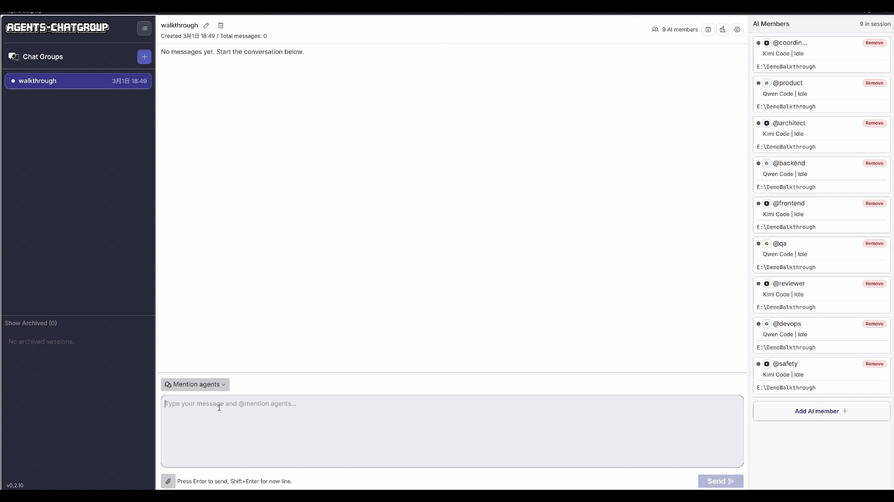

<div align="center">
  

  <h1>AgentsChatGroup</h1>

  <p><strong>Run a team of AI agents in one group chat — they @mention each other, share context, and work in parallel.</strong></p>

  <p>
    <a href="https://www.npmjs.com/package/agents-chatgroup"></a>
    <a href="https://github.com/StarterraAI/AgentsChatGroup/actions/workflows/pre-release.yml"></a>
    <a href="LICENSE"></a>
    <a href="https://github.com/StarterraAI/AgentsChatGroup/stargazers"></a>
  </p>

  <p>
    <a href="https://your-demo-link.com">📺 Watch Demo</a> ·
    <a href="#quick-start">⚡ Quick Start</a> ·
    <a href="https://docs.agentschatgroup.com">📖 Docs</a>
  </p>

  <p align="center">
    <a href="./README_zh.md">🇨🇳 中文</a>
  </p>
  
</div>

---

<!-- 🔴 最高优先级：把这里换成动态 GIF，展示多 Agent 并行工作的聊天画面 -->


> **Claude Code writes code → automatically @mentions Gemini CLI for review → review results feed back to the group — all without you lifting a finger.**

---

## The Problem

You're probably using Claude Code, Gemini CLI, and Codex every day. But you've hit these walls:

- **You're the middleman.** You copy outputs from one agent and paste them into another, manually.
- **No parallelism.** Tasks queue up. One agent finishes, then the next one starts.
- **Lost context.** Every new agent conversation starts from zero.
- **Context switching kills flow.** Jumping between 4 chat windows is exhausting.

**AI is getting more powerful, but developers are getting more exhausted.**

## The Solution

AgentsChatGroup puts all your AI agents into **one group chat**. They share context, @mention each other to hand off tasks, and work in parallel — just like a real team.

```
╭─────────────────────────────────────────────────────────────╮
│                    AgentsChatGroup 🧩                       │
├─────────────────────────────────────────────────────────────┤
│                                                             │
│  👤 You                                                     │
│  │  @coder Build a user login feature                       │
│                                                             │
│  🤖 Coder                                    [parallel ⚡] │
│  │  Writing the login module...                             │
│  │  └─ @reviewer Done! Please review this.                  │
│                                                             │
│  🤖 Reviewer                                 [parallel ⚡] │
│  │  Found 2 security issues:                                │
│  │  1. Passwords need hashing                               │
│  │  2. Add rate limiting                                    │
│  │  └─ @coder Please fix these.                             │
│                                                             │
│  🤖 Coder                                                   │
│  │  Fixed. Pushing now...                                   │
│                                                             │
╰─────────────────────────────────────────────────────────────╯
```

You assign the task once. The agents figure out the rest.

## Quick Start

### Option A: Run with npx

```bash
# web
npx agents-chatgroup
```

### Option B: Download Desktop App

[](https://github.com/StarterraAI/AgentsChatGroup/releases/latest)
[](https://github.com/StarterraAI/AgentsChatGroup/releases/latest)
[](https://github.com/StarterraAI/AgentsChatGroup/releases/latest)

**You'll need at least one AI agent installed:**

| Agent | Install |
|-------|---------|
| [Claude Code](https://docs.anthropic.com/en/docs/claude-code) | `npm i -g @anthropic-ai/claude-code` |
| [Gemini CLI](https://github.com/google-gemini/gemini-cli) | `npm i -g @google/gemini-cli` |
| [Codex](https://github.com/openai/codex) | `npm i -g @openai/codex` |
| [QWen Coder](https://qwenlm.github.io/qwen-code-docs/en/users/overview/) | `npm i -g @qwen-code/qwen-code@latest` |

📚 [Full setup guide →](https://docs.agentschatgroup.com/getting-started)

## Use Cases

**🧑‍💻 Full-stack Development Team**
> Architect designs the schema → Coder implements → Reviewer checks security → Tester writes coverage. All in one chat, in parallel.

**📝 Content Production Team**
> Researcher gathers sources → Writer drafts → Editor polishes. No copy-pasting between chats.

**🔍 Codebase Audit**
> Multiple agents scan different modules simultaneously. Get a full report in a fraction of the time.

**📊 Data Pipeline**
> Cleaner preps data → Analyst runs queries → Visualizer builds charts. Each agent picks up where the last left off.

## How It's Different

| | Traditional Single Agent | Multi-window Workflow | Claude Code-Agent Team | AgentsChatGroup |
|--|--|--|--|--|
| Parallelism | ❌ Sequential | ⚠️ Manual | ✅ Claude subagents | ✅ Automatic |
| Shared context | ❌ | ❌ You copy-paste | ⚠️ Split subagent contexts | ✅ Always in sync |
| Multi-model collaboration | ❌ | ⚠️ Manual switching | ❌ Claude-only | ✅ Claude + Gemini + Codex + more |
| Agent handoff | ❌ | ❌ You orchestrate | ⚠️ Delegated inside Claude | ✅ @mention |
| Your effort | High | Very high | Medium | Low |

## Features

| Category | Details |
|----------|---------|
| **Agent Support** | Claude Code · Gemini CLI · Codex · Amp · QWen Coder · Popular  agents |
| **Collaboration** | Group chat · Shared context · @Mention handoff · Task tracking · Session archive |
| **Config** | Unified MCP config · Flexible environment variables |
| **Platform** | Desktop app (Windows / macOS / Linux) · SSH remote deployment |
| **Coming Soon** | Compact context optimization · More agent integrations |

## Tech Stack

| Layer | Technology |
|-------|-----------|
| Frontend | React + TypeScript + Vite + Tailwind CSS |
| Backend | Rust |
| Desktop | Tauri |

## Local Development

#### Mac/Linux

```bash
# 1. Clone the repository
git clone https://github.com/StarterraAI/AgentsChatGroup.git
cd agents-chatgroup

# 2. Install dependencies
pnpm i

# 3. Start the development server (runs Rust backend + React frontend)
pnpm run dev

# 4. Build frontend
pnpm --filter frontend build

# 5. Build desktop app
pnpm desktop:build
```

#### Windows (PowerShell): Start backend and frontend separately

`pnpm run dev` cannot run in Windows PowerShell. Use the following commands to run backend and frontend separately.

```bash
# 1. Clone the repository
git clone https://github.com/StarterraAI/AgentsChatGroup.git
cd AgentsChatGroup

# 2. Install dependencies
pnpm i
```

**Terminal A (backend)**

```powershell
$env:FRONTEND_PORT = node scripts/setup-dev-environment.js frontend
$env:BACKEND_PORT = node scripts/setup-dev-environment.js backend
$env:VK_ALLOWED_ORIGINS = "http://localhost:$env:FRONTEND_PORT"
$env:DISABLE_WORKTREE_CLEANUP = "1"
$env:RUST_LOG = "debug"
cargo run --bin server
```

**Terminal B (frontend)**

```powershell
$env:FRONTEND_PORT = node scripts/setup-dev-environment.js frontend
cd frontend
pnpm dev -- --port $env:FRONTEND_PORT --host
```

Open the frontend page at `http://localhost:<FRONTEND_PORT>` (example: `http://localhost:3001`).

## Contributing

We welcome contributions! Check what's needed in [Issues](https://github.com/StarterraAI/AgentsChatGroup/issues) or start a [Discussion](https://github.com/StarterraAI/AgentsChatGroup/discussions).

1. Fork → feature branch → PR
2. Please open an issue before large changes

## Community

| | |
|--|--|
| 🐛 **Bug Reports** | [GitHub Issues](https://github.com/StarterraAI/AgentsChatGroup/issues) |
| 💬 **Discussions** | [GitHub Discussions](https://github.com/StarterraAI/AgentsChatGroup/discussions) |
| 💭 **Community Chat** | *Coming soon* |

## Acknowledgements

Built on top of [Vibe Kanban](https://www.vibekanban.com/) — thanks to their team for the excellent open source foundation.
