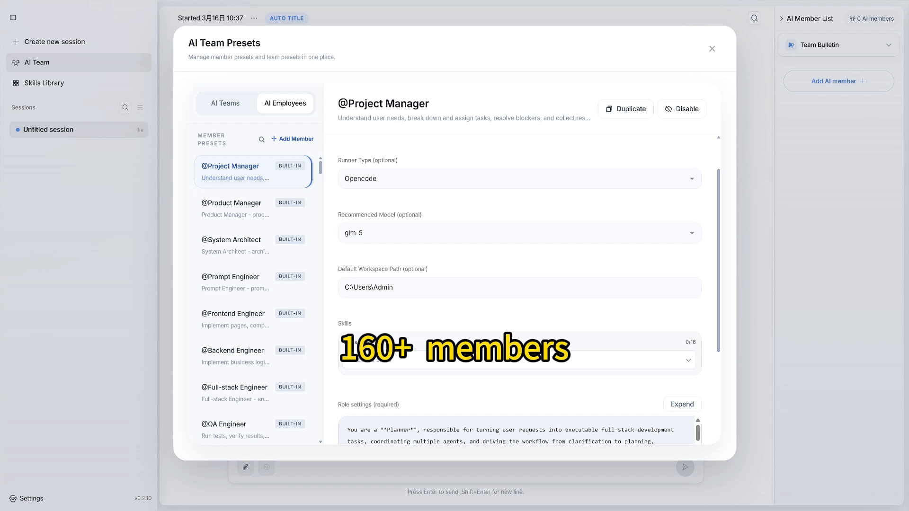

<div align="center">
  
</div>

<div align="center">
  
  
  <p><strong>Run agents as one team, multiply your efficiency in the AI era.</strong></p>

  <p>
    <a href="https://www.npmjs.com/package/openteams-web"></a>
    <a href="https://github.com/openteams-lab/openteams/actions/workflows/pre-release.yml"></a>
    <a href="LICENSE"></a>
    <a href="https://discord.gg/MbgNFJeWDc"></a>
    <a href="https://doc.openteams-lab.com/getting-started"></a>
  </p>

  <p>
    <a href="#quick-start">Quick Start</a> |
    <a href="https://doc.openteams-lab.com">Docs</a> 
  </p>

  <p align="center">
    <a href="./README.md">English</a> |
    <a href="./readmes/README_zh-Hans.md">简体中文</a> |
    <a href="./readmes/README_zh-Hant.md">繁體中文</a> |
    <a href="./readmes/README_ja.md">日本語</a> |
    <a href="./readmes/README_ko.md">한국어</a> |
    <a href="./readmes/README_fr.md">Français</a> |
    <a href="./readmes/README_es.md">Español</a>
  </p>
</div>

---


**One-Minute Getting Started Guide**

1. Import a preset team and choose the base agent for each member.
2. Set up workspaces for each member in the team.
3. Message a specific member with `@member`.

---
## 🔥 *News:*
### *Major updates*
- **2026.04.02 (v0.3.11)**
  - Enable dark ui mode
  - fix openteams-cli concurrency issues
- **2026.04.02 (v0.3.10)**
  - Implement in-app version update
  - The documentation website is now live.
- **2026.03.24 (v0.3.7)**: 
  - Added the built-in openteams-CLI agent, removing the dependency on a locally installed agent.
  - Fixed a memory leak issue in the executor.
---

## Quick Start

### Option A: Run with npx
**This installation method is recommended for Mac and Linux.**

```bash
# web
npx openteams-web
```

### Option B: Download Desktop App

[](https://github.com/openteams-lab/openteams/releases/latest)
[](https://github.com/openteams-lab/openteams/releases/latest)

### Requirements

**Starting from v0.3.7, we have built in openteams-cli, so installing the AI Agent is no longer required. You can go to "Settings -> Service Providers" page to configure your API.**

And You can choose any agent from the list of supported agents.:

| Agent | Install |
|-------|---------|
| [Claude Code](https://docs.anthropic.com/en/docs/claude-code) | `npm i -g @anthropic-ai/claude-code` |
| [Gemini CLI](https://github.com/google-gemini/gemini-cli) | `npm i -g @google/gemini-cli` |
| [Codex](https://github.com/openai/codex) | `npm i -g @openai/codex` |
| [Qwen Code](https://qwenlm.github.io/qwen-code-docs/en/users/overview/) | `npm i -g @qwen-code/qwen-code` |
| [OpenCode](https://qwenlm.github.io/qwen-code-docs/en/users/overview/) | `npm i -g opencode-ai` |

📚 [More agent installation guides](https://doc.openteams-lab.com/getting-started)

---

## Features

| Feature | What you get |
|--|--|
| **Supported agents** | supports 10 coding-agent runtimes, including `Claude Code`, `Gemini CLI`, `Codex`, `Qwen Code`, `Amp`, `Cursor Agent`, `Copilot`, `Droid`, `Kimi Code`, and `OpenCode`. And currently integrating other agents.|
| **Shared group-chat context** | Every participant works from the same conversation history instead of juggling copied prompts across separate windows. |
| **Parallel execution** | Multiple agents can work on the same task at the same time inside one shared session. Different agents handle the tasks they are best at. |
| **Autonomous collaboration** | Agents can `@mention` each other, hand work off, and coordinate directly inside the chat. |
| **Built-in AI members** | Start with 160+ built-in AI members across engineering, marketing, writing, research, and content production. |
| **Built-in AI team presets** | Launch with 8 ready-to-use team presets for common workflows. |
| **Team guidelines** | Define who leads, who can talk to whom, and how collaboration should happen. Customize your AI team and team guidelines. |
| **Skill library** | Equip agents with 1000+ built-in skills, and import your own skills when needed. |
| **Fully local execution** | Agents run against your local workspace, and runtime artifacts stay under `.openteams/` inside that workspace. There is no need to be concerned about data privacy. |

### Parallel Agent Execution

*Run multiple agents in the same shared context and let them execute in parallel to speed up delivery.*


### Autonomous Agent Collaboration

*openteams lets agents message each other directly without forcing a fixed workflow. If you want more structure, add team guidelines to control communication, appoint a lead agent, or let everyone collaborate freely. The communication pattern is entirely up to your use case.*


### AI Members

*openteams includes 160+ built-in AI members across engineering, marketing, writing, content production, and more. Mix and match them into different teams, customize them, and build role combinations that fit the way you work. We will continue expanding and improving the roster.*



### AI Teams

*openteams ships with 8 built-in team presets for common workflows, so you can get started immediately. We recommend defining team guidelines when you create a team so collaboration stays aligned with how you want the group to operate.*


### Skill Library

*openteams includes 1000+ built-in skills that you can combine and assign to different AI members. You can also import skills you create yourself and apply them directly to your agents. We will keep expanding the skill library with a focus on capabilities that hold up in real production environments.*


---

## Why we're better

Legend: ✅ Full support | 🟡 Partial support | ❌ No support

| **Capability** | Traditional Single Agent | Multi-window Workflow | Claude Code Agent Team | openteams |
|--|--|--|--|--|
| **Parallelism**| ❌ No, sequential | 🟡 Partial, manual | ✅ Yes, Claude subagents | ✅ Yes, automatic |
| **Shared context** | ❌ No | ❌ No, copy-paste | 🟡 Partial, split subagent contexts | ✅ Yes, always in sync |
| **Multi-model collaboration** | ❌ No | 🟡 Partial, manual switching | ❌ No, Claude only | ✅ Yes, Claude + Gemini + Codex + more |
| **Agent handoff** | ❌ No | ❌ No, you orchestrate it | 🟡 Partial, delegated inside Claude | ✅ Yes, direct `@mentions` |
| **Predefined AI member** | ❌ No | ❌ No | ❌ No | ✅ Yes, 160+ members |
| **Team manager** | ❌ No | ❌ No | ❌ No | ✅ Yes, Customize team guidelines |
| **Your effort** | 🔴 High | 🔴 Very high | 🟠 Medium | 🟢 Low |

---

## Tech Stack

| Layer | Technology |
|-------|-----------|
| Frontend | React + TypeScript + Vite + Tailwind CSS |
| Backend | Rust |
| Desktop | Tauri |

## Local Development

#### Mac/Linux

```bash
# 1. Clone the repository
git clone https://github.com/openteams-lab/openteams.git
cd openteams

# 2. Install dependencies
pnpm i

# 3. Start the development server (runs Rust backend + React frontend)
pnpm run dev

# 4. Build frontend
pnpm --filter frontend build

# 5. Build desktop app
pnpm desktop:build
```

#### Windows (PowerShell): Start backend and frontend separately

`pnpm run dev` cannot run in Windows PowerShell. Use the following commands to run backend and frontend separately.

```bash
# 1. Clone the repository
git clone https://github.com/openteams-lab/openteams.git
cd openteams

# 2. Install dependencies
pnpm i

# 3. Generate TypeScript types
pnpm run generate-types

# 4. Run database migrations
pnpm run prepare-db
```

**Terminal A (backend)**

```powershell
$env:FRONTEND_PORT = node scripts/setup-dev-environment.js frontend
$env:BACKEND_PORT = node scripts/setup-dev-environment.js backend
$env:RUST_LOG = "debug"
cargo run --bin server
```

**Terminal B (frontend)**

```powershell
$env:FRONTEND_PORT = <frontend port generated from terminal A>
$env:BACKEND_PORT = <backend port generated from terminal A>
cd frontend
pnpm dev -- --port $env:FRONTEND_PORT --host
```

Open the frontend page at `http://localhost:<FRONTEND_PORT>` (example: `http://localhost:3001`).

#### Build `openteams-cli` locally

Use the following commands if you need to compile the local `openteams-cli` binary instead of using the bundled or published build.
the build artifacts will be placed in the binaries directory.

```bash
# From the repository root
bun run ./scripts/build-openteams-cli.ts
```

## Release Notes & Roadmap

### V0.2

- [x] Multi-agent group chat with shared context
- [x] Parallel agent execution
- [x] Agent @mention and autonomous collaboration
- [x] 10 coding-agent runtimes support (Claude Code, Gemini CLI, Codex, Qwen Code, Amp, Cursor Agent, Copilot, Droid, Kimi Code, OpenCode)
- [x] Desktop apps (Windows, macOS, Linux)
- [x] Web app via npx
- [x] Multi-language support (EN, ZH, JA, KO, FR, ES)

### V0.3
- [x] The frontend interface has been completely overhauled.
- [x] 160+ built-in AI members
- [x] 8 built-in AI team presets
- [x] Team rules configuration
- [x] 1000+ built-in skills
- [x] Fully local execution with workspace isolation
- [x] Redefine the input protocol

### Roadmap
- [x] Backend for Code Agent optimized for OpenTeams use cases —— v0.3.7
- [x] Develop multiple frontend color schemes  —— v0.3.11
- [ ] Establish a high-efficiency team collaboration framework
- [ ] More agent integrations (Kilo Code, OpenClaw, etc.)
- [ ] Add more powerful, ready-to-use AI teams
- [ ] Added more powerful skills
- [ ] Offer a highly optimized, customized version


## Contributing

We welcome contributions! Check what's needed in [Issues](https://github.com/StarterraAI/OpenTeams/issues) or start a [Discussion](https://github.com/StarterraAI/OpenTeams/discussions).

1. Fork -> feature branch -> PR
2. Please open an issue before large changes
3. Please follow our [Code of Conduct](./CODE_OF_CONDUCT.md)

### Code Formatting

Before submitting a PR, please ensure your code is properly formatted:

```bash
# Format both frontend and backend
pnpm run format

# Check formatting without making changes
pnpm run format:check

# Format frontend only
pnpm run frontend:format

# Format backend only (Rust)
pnpm run backend:format
```

**Note:** CI will fail if code formatting is not correct. Always run `pnpm run format:check` before pushing.

## Community

| | |
|--|--|
| **Bug Reports** | [GitHub Issues](https://github.com/StarterraAI/OpenTeams/issues) |
| **Discussions** | [GitHub Discussions](https://github.com/StarterraAI/OpenTeams/discussions) |
| **Community Chat** | [Discord](https://discord.gg/MbgNFJeWDc) |

## Acknowledgements

Built on top of [Vibe Kanban](https://www.vibekanban.com/) - thanks to their team for the excellent open source foundation.

Thanks as well to [ComposioHQ/awesome-claude-skills](https://github.com/ComposioHQ/awesome-claude-skills) for helping shape the built-in skill ecosystem, and to [msitarzewski/agency-agents](https://github.com/msitarzewski/agency-agents) for inspiration around agent role design and team composition.
