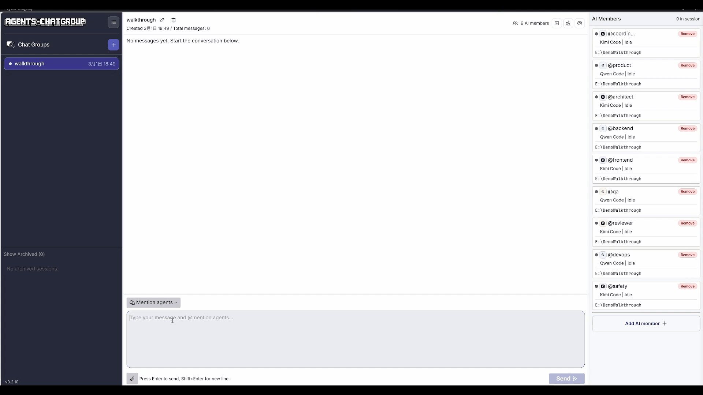
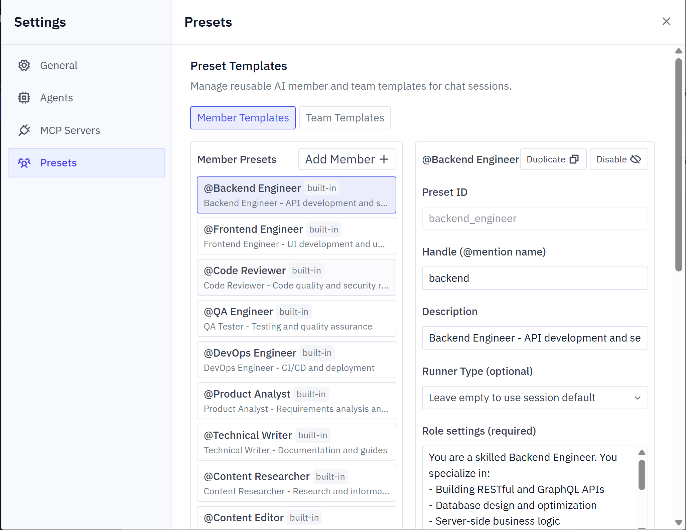

<div align="center">
  

  <h1>OpenTeams</h1>

  <p><strong>在一个群聊中运行一支 AI Agent 团队：它们会互相 @mention、共享上下文、并行协作。</strong></p>

  <p>
    <a href="https://www.npmjs.com/package/openteams"></a>
    <a href="https://github.com/StarterraAI/OpenTeams/actions/workflows/pre-release.yml"></a>
    <a href="LICENSE"></a>
    <a href="https://discord.gg/MbgNFJeWDc"></a>
    <a href="https://docs.openteams.com/getting-started"></a>
  </p>

  <p>
    <a href="https://your-demo-link.com">观看演示</a> |
    <a href="#快速开始">快速开始</a> |
    <a href="https://docs.openteams.com">文档</a>
  </p>

  <p align="center">
    <a href="./README.md">English</a>
  </p>
  
</div>

---



---


## 快速开始

### 方案 A：使用 npx 运行

```bash
# web
npx openteams
```

### 方案 B：下载桌面应用

[](https://github.com/StarterraAI/OpenTeams/releases/latest)
[](https://github.com/StarterraAI/OpenTeams/releases/latest)
[](https://github.com/StarterraAI/OpenTeams/releases/latest)

**你至少需要安装一个 AI Agent：**

| Agent | 安装命令 |
|-------|---------|
| [Claude Code](https://docs.anthropic.com/en/docs/claude-code) | `npm i -g @anthropic-ai/claude-code@2.1.74` |
| [Gemini CLI](https://github.com/google-gemini/gemini-cli) | `npm i -g @google/gemini-cli@0.33.0` |
| [Codex](https://github.com/openai/codex) | `npm i -g @openai/codex@0.114.0` |
| [QWen Coder](https://qwenlm.github.io/qwen-code-docs/en/users/overview/) | `npm i -g @qwen-code/qwen-code@0.12.1` |

📚 [更多 Agent 安装指南 →](https://docs.openteams.com/getting-started)

## 为什么要开发这个应用？

你可能每天都在用 Claude Code、Gemini CLI、Codex。你是否遇到过这些问题？

- **你成了中间人。** 需要手动把一个 Agent 的输出复制粘贴给另一个。
- **无法并行。** 任务排队执行，一个结束后下一个才能开始。
- **上下文丢失。** 每个新 Agent 会话都要从零开始解释背景。
- **频繁切换窗口打断思路。** 在多个聊天窗口之间来回跳转非常消耗精力。

**AI 越来越强，但开发者却越来越疲惫。**

## 解决方案

OpenTeams 把所有 AI Agent 放进**同一个群聊**。它们共享上下文，通过 `@mention` 交接任务，并行协作，像一支真正的团队一样工作。


```
╭─────────────────────────────────────────────────────────────╮
│                    OpenTeams 🧩                       │
├─────────────────────────────────────────────────────────────┤
│                                                             │
│  👤 You                                                     │
│  │  @coder Build a user login feature                       │
│                                                             │
│  🤖 Coder                                    [parallel ⚡] │
│  │  Writing the login module...                             │
│  │  └─ @reviewer Done! Please review this.                  │
│                                                             │
│  🤖 Reviewer                                 [parallel ⚡] │
│  │  Found 2 security issues:                                │
│  │  1. Passwords need hashing                               │
│  │  2. Add rate limiting                                    │
│  │  └─ @coder Please fix these.                             │
│                                                             │
│  🤖 Coder                                                   │
│  │  Fixed. Pushing now...                                   │
│                                                             │
╰─────────────────────────────────────────────────────────────╯
```

你只需要分配一次任务，剩下的交给 Agent 团队自己协同完成。

## 有什么不同

| 能力 | 🧍 传统单 Agent | 🪟 多窗口工作流 | 🤖 Claude Code-Agent Team | 🧩 OpenTeams |
|--|--|--|--|--|
| 并行能力 | ❌ 不支持（串行） | ⚠️ 部分支持（手动） | ✅ 支持（Claude 子代理） | ✅ 支持（自动） |
| 上下文共享 | ❌ 不支持 | ❌ 不支持（复制粘贴） | ⚠️ 部分支持（子代理上下文分裂） | ✅ 支持（始终同步） |
| 多模型协作 | ❌ 不支持 | ⚠️ 部分支持（手动切换） | ❌ 不支持（仅 Claude） | ✅ 支持（Claude + Gemini + Codex + 更多） |
| Agent 任务交接 | ❌ 不支持 | ❌ 不支持（你手动编排） | ⚠️ 部分支持（仅 Claude 内委派） | ✅ 支持（@mention） |
| 你的投入成本 | 🔺 高 | 🔺 很高 | ◼️ 中 | 🔹 低 |

## 功能特性

| 类别 | 详情 |
|----------|---------|
| **Agent 支持** | Claude Code、Gemini CLI、Codex、Amp、QWen Coder，以及其他热门 Agent |
| **协作能力** | 群聊、共享上下文、@mention 交接、任务追踪、会话归档 |
| **团队预设** | 22 个内置成员预设、8 个内置团队预设、一键导入团队、支持完整 CRUD 的自定义预设 |
| **配置管理** | 统一 MCP 配置、灵活环境变量 |
| **平台支持** | 桌面应用（Windows / macOS / Linux）、Web 应用（npx） |
| **即将推出** | 更紧凑的上下文优化、更多 Agent 集成 |


## AI 团队预设

不用再反复配置同一批 Agent。OpenTeams 内置 **22 个成员预设** 和 **8 个团队预设**，可一键导入。



你也可以创建并保存自己的自定义预设。导入团队时会显示预览，清楚标明哪些成员会被创建、复用或重命名，避免意外。

📚 [团队预设文档](https://docs.openteams.com/core-features/ai-team-presets)

---

### 使用场景

**全栈开发团队**
> 架构师设计 schema -> 开发实现 -> 审查安全 -> 测试补覆盖。全程在一个群聊并行推进。

**内容生产团队**
> 研究收集资料 -> 写作起草 -> 编辑润色。无需在多个聊天之间复制粘贴。

**代码库审计**
> 多个 Agent 同时扫描不同模块，用更短时间得到完整报告。

**数据管道协作**
> 清洗预处理 -> 分析查询 -> 可视化产图。每个 Agent 都能无缝承接上一环节。

组建更多 AI 团队，未来由你来创造。


## 技术栈

| 层级 | 技术 |
|-------|-----------|
| 前端 | React + TypeScript + Vite + Tailwind CSS |
| 后端 | Rust |
| 桌面端 | Tauri |

## 本地开发

#### Mac/Linux

```bash
# 1. 克隆仓库
git clone https://github.com/StarterraAI/OpenTeams.git
cd openteams

# 2. 安装依赖
pnpm i

# 3. 启动开发服务器（同时启动 Rust 后端 + React 前端）
pnpm run dev

# 4. 构建前端
pnpm --filter frontend build

# 5. 构建桌面应用
pnpm desktop:build
```

#### Windows (PowerShell)：前后端分开启动

`pnpm run dev` 无法在 Windows PowerShell 中运行。请使用下面的命令分别启动后端和前端。

```bash
# 1. 克隆仓库
git clone https://github.com/StarterraAI/OpenTeams.git
cd OpenTeams

# 2. 安装依赖
pnpm i

# 3. 生成 TypeScript 类型
pnpm run generate-types

# 4. 执行数据库迁移准备
pnpm run prepare-db
```

**终端 A（后端）**

```powershell
$env:FRONTEND_PORT = node scripts/setup-dev-environment.js frontend
$env:BACKEND_PORT = node scripts/setup-dev-environment.js backend
$env:RUST_LOG = "debug"
cargo run --bin server
```

**终端 B（前端）**

```powershell
$env:FRONTEND_PORT = <frontend port generated from terminal A>
$env:BACKEND_PORT = <backend port generated from terminal A>
cd frontend
pnpm dev -- --port $env:FRONTEND_PORT --host
```

打开前端页面：`http://localhost:<FRONTEND_PORT>`（例如：`http://localhost:3001`）。

## 贡献

欢迎贡献！你可以在 [Issues](https://github.com/StarterraAI/OpenTeams/issues) 查看待办，或在 [Discussion](https://github.com/StarterraAI/OpenTeams/discussions) 发起讨论。

1. Fork -> 创建 feature 分支 -> 提交 PR
2. 大改动请先开 issue 沟通
3. 请遵守我们的 [Code of Conduct](./CODE_OF_CONDUCT.md)

## 社区

| | |
|--|--|
| **问题反馈** | [GitHub Issues](https://github.com/StarterraAI/OpenTeams/issues) |
| **讨论交流** | [GitHub Discussions](https://github.com/StarterraAI/OpenTeams/discussions) |
| **社区聊天** | [Discord](https://discord.gg/MbgNFJeWDc) |

## 致谢

本项目基于 [Vibe Kanban](https://www.vibekanban.com/) 构建，感谢其团队提供优秀的开源基础。
