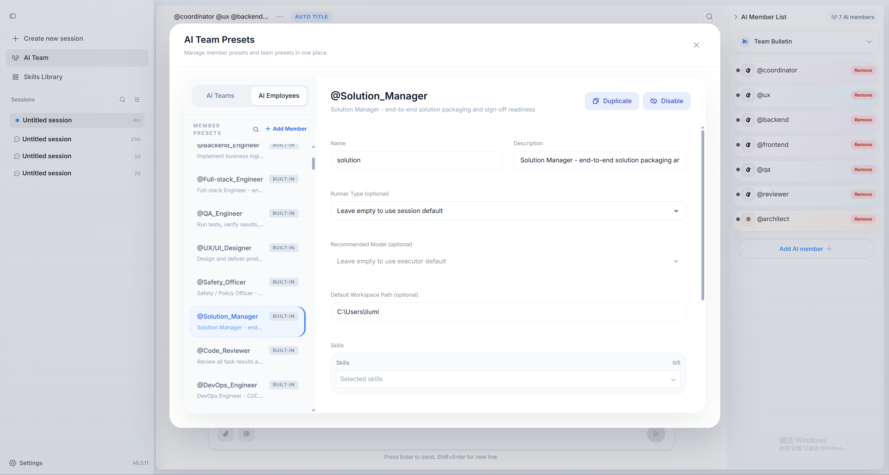
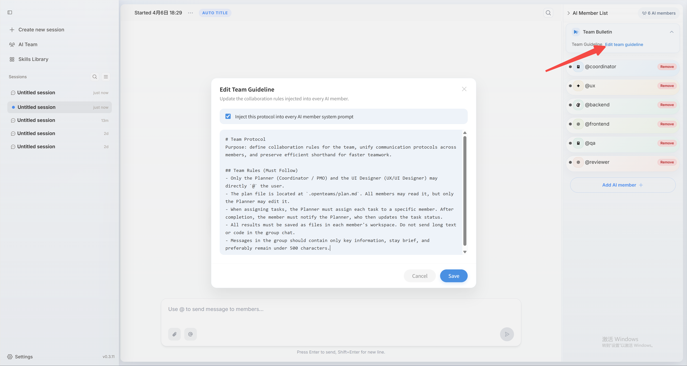
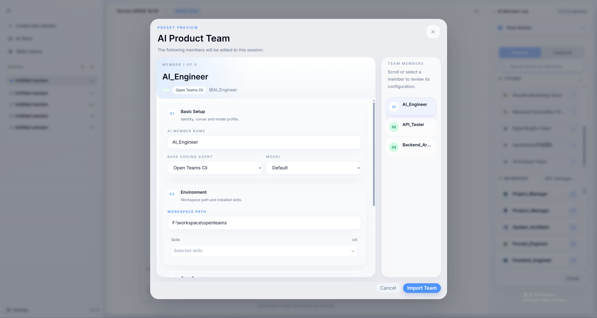

{(() => {
  if (typeof window === 'undefined') return null;
  var path = window.location.pathname.replace(/\/+$/, '') || '/';
  var basePath = path === '/docs' || path.startsWith('/docs/') ? '/docs' : '';
  var relativePath = basePath ? (path.slice(basePath.length) || '/') : path;
  var localePrefixes = ['zh-Hans', 'zh-Hant', 'ja', 'ko', 'fr'];
  if (localePrefixes.some(function(prefix) {
    return relativePath === '/' + prefix || relativePath.startsWith('/' + prefix + '/');
  })) return null;
  try {
    if (document.referrer) {
      var referrerUrl = new URL(document.referrer);
      if (referrerUrl.origin === window.location.origin) return null;
    }
  } catch (error) {}
  var candidates = Array.isArray(navigator.languages) && navigator.languages.length
    ? navigator.languages
    : [navigator.language || 'en'];
  var matched = 'en';
  for (var i = 0; i < candidates.length; i += 1) {
    var normalized = String(candidates[i] || '').toLowerCase();
    if (normalized.indexOf('zh-hant') === 0 || normalized.indexOf('zh-tw') === 0 || normalized.indexOf('zh-hk') === 0 || normalized.indexOf('zh-mo') === 0) {
      matched = 'zh-Hant';
      break;
    }
    if (normalized.indexOf('zh') === 0) {
      matched = 'zh-Hans';
      break;
    }
    if (normalized.indexOf('ja') === 0) {
      matched = 'ja';
      break;
    }
    if (normalized.indexOf('ko') === 0) {
      matched = 'ko';
      break;
    }
    if (normalized.indexOf('fr') === 0) {
      matched = 'fr';
      break;
    }
  }
  if (matched === 'en') return null;
  var targetRelativePath = relativePath === '/' ? '/' + matched : '/' + matched + relativePath;
  var target = basePath + targetRelativePath + window.location.search + window.location.hash;
  if (target !== window.location.pathname + window.location.search + window.location.hash) {
    window.location.replace(target);
  }
  return null;
})()}

## Built-in AI members

openteams does not treat AI as just another tool. It treats AI as team members, and those members are the basic unit of collaboration inside the product.

As AI capabilities improve, we expect AI members to handle more work independently. That is why each AI member in openteams is designed to have its own role, dedicated skills, and workspace. You can assign the model that best fits each member's responsibilities so they can contribute more effectively inside a team workflow.

openteams comes with 160 built-in AI members covering common roles across development, content creation, marketing, operations, data analysis, and more. You can use them directly to build a team, adjust them to fit your workflow, or add custom AI members when you need something more specific.

These built-in members currently come from the open-source project [Agency-Agents](https://github.com/msitarzewski/agency-agents). We redesigned and reconfigured them to better fit the collaboration model used by openteams, and we plan to keep expanding the library with more useful built-in members over time.

You can add the built-in AI members that best match your use case directly from the preset member list.

<video src="../images/en/member_import.mp4" autoPlay loop muted playsInline />

## Add custom AI members

You can create custom AI members directly inside a session. Fill in the member name, choose the agent and model, define the member's role, set the workspace path, and assign the skills that member should use.

<video src="../images/en/custom_member_zh.mp4" autoPlay loop muted playsInline />

If you want to reuse a custom AI member across multiple sessions, it is better to create that member as a global preset. That way, you can import it into other sessions directly instead of recreating it each time.

<video src="../images/en/create_preset_ai_member.mp4" autoPlay loop muted playsInline />

## Define team rules

Team rules let you control how members collaborate. For example, you can allow only one AI member to talk directly with you while the others execute tasks silently, or you can stop AI members from talking to each other and require them to respond only to user messages. The exact setup depends on how you want your team to work.

<Note>
Team rules are currently a soft constraint. The system does not yet guarantee that they will always be enforced. In practice, they still rely on the AI members following those instructions.
</Note>

## Create a custom team

AI teams are one of the core ideas in openteams. You can build your own teams inside the app and use them to handle real work.

The process is simple: name the team, define the team rules, add the AI members, and save the configuration so you can import it again later when needed.

<video src="../images/en/create_custom_teams.mp4" autoPlay loop muted playsInline />

Building an effective team is one of the most important factors in improving multi-agent collaboration. We currently provide 8 ready-to-use preset teams and plan to keep adding more useful ones.

## Use a custom team

Once you create a custom team, you can import the whole team directly into a session and start collaborating immediately.

