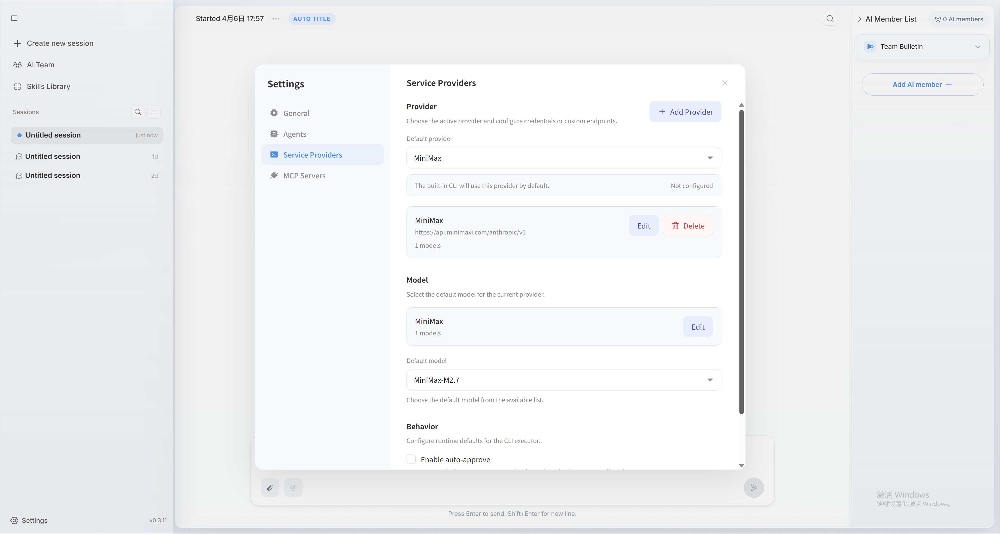
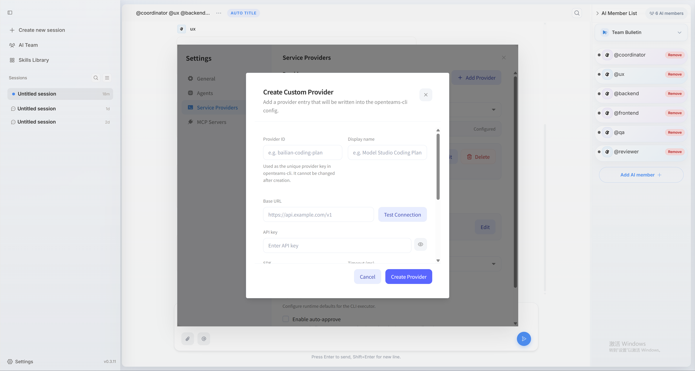
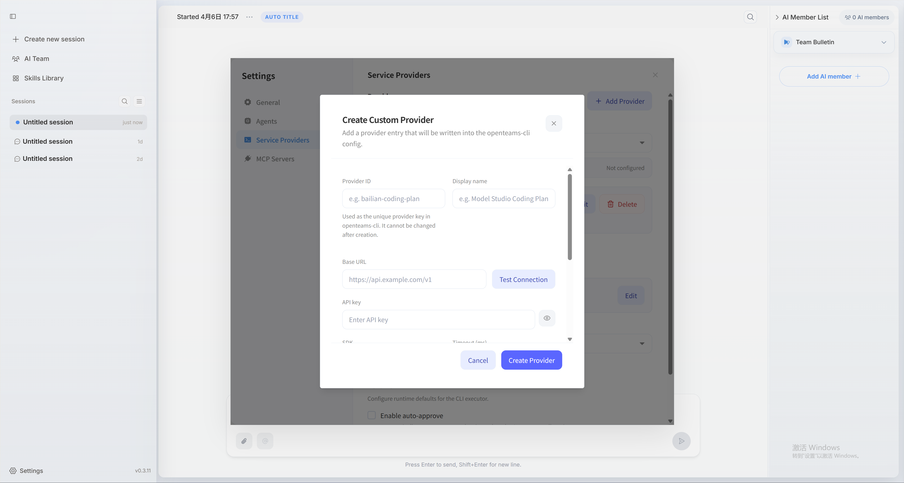

## Configuration page

Go to `Settings -> Service Providers` and open the **Service Providers** configuration section.

## Configure model providers

<Tabs>

  <Tab title="Create a custom provider">
    <video src="../images/en/config_provider.mp4" autoPlay loop muted playsInline />

    <Steps>
      <Step title="Create a provider">
        In the top-right area of the service provider settings page, click **Add Provider**, then fill in the provider ID, provider name, Base URL, API key, and SDK.

        
      </Step>

      <Step title="Configure models and save">
        Click **Add Model**, then fill in the model ID, display name, context limit, output limit, and input/output modalities before saving.

        

        Refer to the model vendor documentation for the exact values to use. Context and output limits are optional. If you leave them blank, the defaults are used.

        **We recommend following the values suggested by the model provider. Incorrect values may affect model performance.**
      </Step>
    </Steps>
  </Tab>

  <Tab title="Supported providers">
    Enter the API key for the provider you want to use, then choose the relevant model. After saving, the model becomes available in member configuration.

    <CardGroup cols={2}>
      <Card title="OpenAI" icon="/logos/openai-logo.svg">
        Supports GPT models. Once the API key is configured, you can use them directly.
      </Card>

      <Card title="Anthropic" icon="/logos/claude.svg">
        Supports Claude models. Well suited to long-context work and more complex reasoning.
      </Card>

      <Card title="Google" icon="/logos/gemini-logo.svg">
        Supports Gemini models across the Google AI and Vertex ecosystem.
      </Card>

      <Card title="Ollama" icon="/logos/openai-logo.svg">
        Supports model services exposed through an Ollama deployment endpoint.
      </Card>

      <Card title="OpenRouter" icon="globe">
        Lets you route requests across multiple model providers and switch models flexibly.
      </Card>

      <Card title="MiniMax" icon="/logos/minimax-color.svg">
        Supports the full MiniMax model family and is especially useful for users in China.
      </Card>
    </CardGroup>
  </Tab>

</Tabs>

