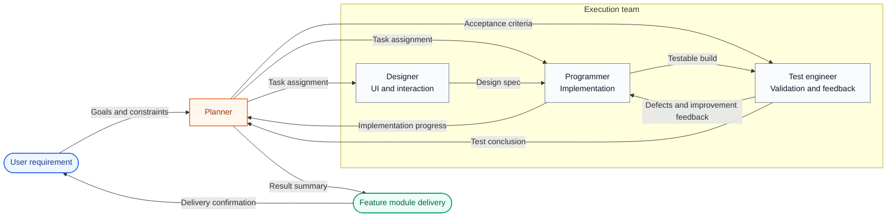
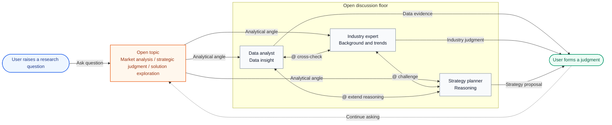

<script id="openteams-browser-language-redirect">{`(function(){
  if (typeof window === 'undefined') return;
  var path = window.location.pathname.replace(/\/+$/, '') || '/';
  var basePath = path === '/docs' || path.startsWith('/docs/') ? '/docs' : '';
  var relativePath = basePath ? (path.slice(basePath.length) || '/') : path;
  var localePrefixes = ['zh-Hans', 'zh-Hant', 'ja', 'ko', 'fr'];
  if (localePrefixes.some(function(prefix) {
    return relativePath === '/' + prefix || relativePath.startsWith('/' + prefix + '/');
  })) return;
  try {
    if (document.referrer) {
      var referrerUrl = new URL(document.referrer);
      if (referrerUrl.origin === window.location.origin) return;
    }
  } catch (error) {}
  var candidates = Array.isArray(navigator.languages) && navigator.languages.length
    ? navigator.languages
    : [navigator.language || 'en'];
  var matched = 'en';
  for (var i = 0; i < candidates.length; i += 1) {
    var normalized = String(candidates[i] || '').toLowerCase();
    if (normalized.indexOf('zh-hant') === 0 || normalized.indexOf('zh-tw') === 0 || normalized.indexOf('zh-hk') === 0 || normalized.indexOf('zh-mo') === 0) {
      matched = 'zh-Hant';
      break;
    }
    if (normalized.indexOf('zh') === 0) {
      matched = 'zh-Hans';
      break;
    }
    if (normalized.indexOf('ja') === 0) {
      matched = 'ja';
      break;
    }
    if (normalized.indexOf('ko') === 0) {
      matched = 'ko';
      break;
    }
    if (normalized.indexOf('fr') === 0) {
      matched = 'fr';
      break;
    }
  }
  if (matched === 'en') return;
  var targetRelativePath = relativePath === '/' ? '/' + matched : '/' + matched + relativePath;
  var target = basePath + targetRelativePath + window.location.search + window.location.hash;
  if (target !== window.location.pathname + window.location.search + window.location.hash) {
    window.location.replace(target);
  }
})();`}</script>


AI members in openteams collaborate inside a shared chat session. They share the same chat history, you can assign work by messaging members with `@mentions`, and AI members can also `@mention` each other to complete tasks together.

## What is a chat session?

A chat session is the basic workspace for all AI members. It is where you send messages, assign work, and let members coordinate with each other.
In most cases, one session maps to one project or one work topic. For example, you can create a session for a software feature and add software-focused AI members to build that feature together.

<Frame caption="Messages in a chat session include user messages, AI member messages, task messages, and system messages.">
  
</Frame>

### Message types inside a session

Messages in a chat session usually fall into four categories. Once you understand these types, you can quickly tell whether a message is asking for work, reporting progress, reflecting system state, or delivering a final result.

<CardGroup cols={2}>
  <Card title="User messages" icon="user">
    Sent by you. They usually contain task goals, extra instructions, attachments, quoted messages, and collaboration constraints.
  </Card>
  <Card title="AI member messages" icon="bot">
    Sent by AI members. They usually report execution progress, raise questions, share analysis, or coordinate with other members.
  </Card>
  <Card title="System messages" icon="bell">
    Generated automatically by the system. They usually show task state changes, member joins or removals, permission prompts, and other system notifications.
  </Card>
  <Card title="Task messages" icon="file-text">
    Submitted by AI members after a task is completed. They focus on final deliverables and explicit conclusions, such as code files, documentation, or analysis results.
  </Card>
</CardGroup>

<Note>
Task messages also usually come from AI members, but because they carry reusable deliverables, they are documented as a separate category.
</Note>

### Message quoting

You can quote a specific AI member message in the group chat and submit revision feedback directly against that message.


### Chat history

When you add multiple AI members, chat history grows quickly. Because of that, openteams does not send the full history directly to the agent. Instead, it writes the history into a `message.jsonl` file and tells the agent to read it only when needed.

Agents also maintain their own memory mechanisms internally. They retain the messages you send them as well as historical messages they have already read. This keeps task understanding consistent without exposing the full history directly in every prompt.

The complete message history is stored in `<project_dir>/.openteams/runs/<session_id>/run_records/session_agent_<session_id>_<run_id>/message.jsonl`.
You can review that file to quickly inspect the full message history of the collaboration.

## Manage chat sessions

Right-click a session to open a menu where you can rename the session, archive it, clear its messages, or delete it.


## Design principles behind group chat

<Note>
The goal of openteams chat sessions is not to display more messages at once. The goal is to help you see higher-value information and make decisions at lower cost while keeping collaboration efficient.
</Note>

To reduce information noise and keep multi-member collaboration controllable, the system is designed around two governance dimensions.

### Two governance dimensions

| Dimension | Core goal | How it works |
| --- | --- | --- |
| Information governance | Reduce noise and increase information density | The system strictly controls what enters the main timeline so that only information directly related to the current task appears there. This keeps the conversation coherent, focused, and easier to understand. |
| Execution governance | Improve process control and result traceability | Task state transitions and workflow constraints are used to manage execution so every task stays visible, traceable, reversible, and retryable. |

### Two product forms

Based on these two governance dimensions, chat sessions are designed in two forms that stay independent while still supporting unified collaboration.

<CardGroup cols={2}>
  <Card title="Divergent discussion" icon="brain">
    Different agents play different roles and contribute ideas from multiple perspectives, making up for the limitations of a single-agent point of view.

    **Best for high-uncertainty work such as planning, solution design, creative writing discussion, and brainstorming.**
  </Card>
  <Card title="Convergent collaboration" icon="wrench">
    Discussion outcomes are pushed into execution and delivery. Multi-agent execution must stay controllable, with support for intervention, interruption, and correction at any time.

    **Best for task scenarios that need clear outputs, ongoing tracking, and convergence toward a final result.**
  </Card>
</CardGroup>

<Note>
These two forms map to the Open mode and Work mode described below. The first emphasizes exploration and discussion, while the second emphasizes execution and delivery.
</Note>

## Chat work modes

At the implementation level, openteams uses two modes to support those two product forms: Open mode is oriented toward exploration and discussion, while Work mode is oriented toward execution and delivery.

| Mode | Corresponding form | Collaboration style | Good for |
| --- | --- | --- | --- |
| Open mode | Divergent discussion | Multiple agents can talk freely and challenge each other in chained discussions | Planning discussions, brainstorming, problem exploration |
| Work mode | Convergent collaboration | A lead agent coordinates task execution while the main timeline keeps only high-value messages | Task delivery, final outputs, process acceptance |

<Tabs>
<Tab title="Open mode">
  The core traits of Open mode are decentralization and flexible collaboration.

  - Multiple agents in the session can speak independently and also collaborate through `@mentions`
  - The conversation flow stays relatively open, which is useful for parallel viewpoints, extra context, and productive disagreement
  - To avoid endless circular conversations, the system limits propagation depth through `ChainDepth`
  - You are expected to synthesize the different perspectives and make the final judgment

</Tab>

<Tab title="Work mode">
  <Note>Planned for v0.3.12</Note>

  The core traits of Work mode are centralized control and outcome orientation.

  <Info>
  In Work mode, the group chat no longer carries a free-flowing message stream. Instead, it acts as the entry point for task execution.
  What matters to you is no longer who said what, but whether the task is moving forward, where conflicts appeared, and whether the result is ready for acceptance.
  </Info>

  ### Standard execution flow

  <Steps>
  <Step title="Break the task down">
    A lead agent receives the user goal and splits it into executable subtasks.
  </Step>
  <Step title="Run sub-agents in parallel">
    Sub-agents execute within their own responsibilities while the lead agent coordinates timing, summarizes progress, and handles exceptions.
  </Step>
  <Step title="Accept the result">
    The lead agent aggregates the outputs and delivers them to you. You mainly step in for result confirmation, conflict handling, and acceptance decisions.
  </Step>
  </Steps>

  ### Main timeline contract

  | Messages allowed into the main timeline | Description |
  | --- | --- |
  | Requirement confirmation | The lead agent confirms goals, scope, and prerequisites |
  | Conflict escalation | Issues or conflicts that require a user decision during execution |
  | Result acceptance | Final deliverables, conclusions, and pending confirmations |

  <Tip>
  Other process-heavy content is usually collapsed, captured as artifacts, or kept in execution logs instead of being pushed directly into the main timeline.
  </Tip>

  ### Collaboration boundaries

  - The group chat carries a workflow, not an unconstrained message stream
  - Each agent focuses on its own task stage instead of chatting idly in the main timeline
  - Shared context is coordinated and distilled by the lead so the user is not constantly interrupted by intermediate details

  ```text
  User task
      ↓
  Lead agent breaks down the task
      ↓
  Sub-agents execute in parallel
      ├─ Conflict appears or key information is missing
      │      ↓
      │  Request user decision
      │      ↓
      │  Continue after user confirms
      │
      ├─ User interrupts actively
      │      ↓
      │  Pause current execution and adjust the task
      │      ↓
      │  Reassign or continue execution
      │
      ↓
  Lead agent aggregates and accepts
      ↓
  Deliver result to user
  ```
</Tab>
</Tabs>

<Note>
If Open mode is about seeing the discussion process, Work mode is about seeing only the information that actually requires your decision.
</Note>

## Use cases

### Collaborative development

In this scenario, one chat session usually contains a small team with roles such as planner, designer, programmer, and test engineer working together toward a complex feature goal.
The planner handles requirement analysis and task breakdown, the designer handles interface and interaction design, the programmer handles implementation, and the test engineer handles validation and feedback.



This diagram shows a more typical specialist collaboration structure in Work mode: a lead agent takes in the user goal, breaks down the task, consolidates feedback, and completes delivery, while the other roles push work forward within their own responsibilities.

After multiple iterations, the team delivers a complete feature module to the user. In this kind of scenario, the chat session naturally fits Work mode and emphasizes result delivery.

### Research and discussion

In this scenario, multiple AI members usually discuss an open topic freely in the group, each expressing their own understanding, analysis, and viewpoint based on their role. The user then synthesizes those inputs into a judgment.
For example, in a market analysis scenario, a data analyst may provide quantitative insight, an industry expert may provide background and trend analysis, and a strategy planner may contribute logical reasoning.
They can `@mention` each other for challenge and follow-up, while the user evaluates the issue from multiple angles and forms a conclusion.



This diagram shows the more typical structure for Open mode: multiple roles continuously supplement, question, and extend each other around the same topic, while the user builds a judgment from multi-perspective input.

So in this kind of scenario, the chat session tends to fit Open mode and emphasizes exploration and discussion.

### More scenarios

We hope you create even more interesting use cases with openteams. Feel free to share your experience and examples with the community.
