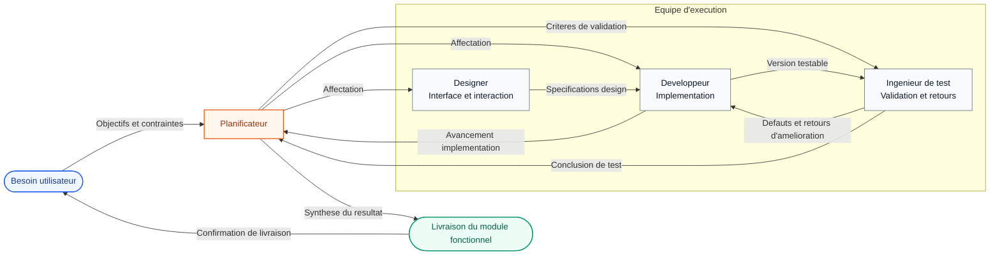
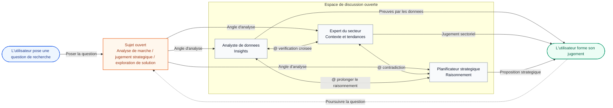

Dans openteams, les membres IA collaborent au sein d'une meme session de chat. Ils partagent l'historique de la conversation, vous pouvez leur attribuer des taches avec des `@mentions`, et les membres IA peuvent aussi se `@mentionner` entre eux pour mener un travail commun.

## Qu'est-ce qu'une session de chat ?

Une session de chat est l'espace de travail de base pour tous les membres IA. C'est dans cet espace que vous envoyez des messages, affectez des taches et laissez les membres cooperer entre eux.
En general, une session correspond a un projet ou a un theme de travail. Par exemple, vous pouvez creer une session pour une fonctionnalite logicielle et y ajouter des membres IA orientes developpement pour la realiser ensemble.

<Frame caption="Les messages d'une session de chat incluent des messages utilisateur, des messages de membres IA, des messages de tache et des messages systeme.">
  
</Frame>

### Types de messages dans une session

Les messages d'une session de chat se divisent generalement en quatre categories. Une fois ces types compris, vous pouvez plus vite identifier si un message formule une demande, fait un point d'avancement, signale un etat systeme ou livre un resultat final.

<CardGroup cols={2}>
  <Card title="Messages utilisateur" icon="user">
    Envoyes par vous. Ils contiennent generalement l'objectif de la tache, des instructions complementaires, des pieces jointes, des messages cites et des contraintes de collaboration.
  </Card>
  <Card title="Messages des membres IA" icon="bot">
    Envoyes par les membres IA. Ils servent en general a partager l'avancement, poser des questions, synchroniser une analyse ou collaborer avec d'autres membres.
  </Card>
  <Card title="Messages systeme" icon="bell">
    Generes automatiquement par le systeme. Ils affichent generalement les changements d'etat, l'ajout ou le retrait de membres, les alertes de permission et d'autres notifications systeme.
  </Card>
  <Card title="Messages de tache" icon="file-text">
    Soumis par les membres IA apres la fin d'une tache. Ils mettent l'accent sur les livrables finaux et des conclusions explicites, comme des fichiers de code, du contenu documentaire ou des resultats d'analyse.
  </Card>
</CardGroup>

<Note>
Les messages de tache proviennent eux aussi generalement de membres IA, mais comme ils portent des livrables reutilisables, ils sont documentes comme une categorie distincte.
</Note>

### Citation de message

Vous pouvez citer un message precis d'un membre IA dans le chat de groupe et soumettre directement des demandes de modification a partir de ce message.


### Historique du chat

Quand plusieurs membres IA participent, l'historique du chat grossit tres vite. Pour cette raison, openteams n'envoie pas directement tout l'historique a l'agent. Le systeme l'ecrit dans un fichier `message.jsonl` et indique a l'agent de le lire uniquement quand c'est necessaire.

Les agents maintiennent aussi leur propre mecanisme de memoire. Ils conservent les messages que vous leur envoyez ainsi que les anciens messages qu'ils ont deja lus. Cela permet de garder une comprehension coherente du contexte sans exposer directement tout l'historique dans chaque prompt.

L'historique complet des messages est stocke dans `<project_dir>/.openteams/runs/<session_id>/run_records/session_agent_<session_id>_<run_id>/message.jsonl`.
Vous pouvez consulter ce fichier pour revoir rapidement l'ensemble des echanges de la collaboration.

## Gerer les sessions de chat

Faites un clic droit sur une session pour ouvrir un menu dans lequel vous pouvez renommer la session, l'archiver, effacer ses messages ou la supprimer.


## Principes de conception du chat de groupe

<Note>
L'objectif des sessions de chat openteams n'est pas de faire apparaitre plus de messages en meme temps. L'objectif est de vous montrer une information plus utile et de reduire le cout de decision tout en preservant l'efficacite de la collaboration.
</Note>

Pour reduire le bruit informationnel et garder la collaboration multi-membres sous controle, le systeme s'appuie sur deux dimensions de gouvernance.

### Deux dimensions de gouvernance

| Dimension | Objectif principal | Mise en oeuvre |
| --- | --- | --- |
| Gouvernance de l'information | Reduire le bruit et augmenter la densite d'information | Le systeme controle strictement ce qui entre dans la timeline principale afin que seules les informations directement liees a la tache courante y apparaissent. Cela garde le fil coherent, focalise et plus simple a comprendre. |
| Gouvernance de l'execution | Ameliorer le controle du processus et la tracabilite des resultats | Les transitions d'etat des taches et les contraintes de workflow permettent de piloter l'execution afin que chaque tache reste visible, tracable, reversible et relancable. |

### Deux formes de produit

Sur la base de ces deux dimensions, les sessions de chat sont concues selon deux formes qui restent distinctes tout en pouvant cooperer de facon unifiee.

<CardGroup cols={2}>
  <Card title="Discussion divergente" icon="brain">
    Differents agents jouent differents roles et apportent des points de vue varies, ce qui compense les limites d'un point de vue porte par un seul agent.

    **Adapte aux situations tres ouvertes, comme la planification, la definition de solutions, la discussion creative ou le brainstorming.**
  </Card>
  <Card title="Collaboration convergente" icon="wrench">
    Les resultats de la discussion sont pousses vers l'execution et la livraison. L'execution multi-agents doit rester controllable, avec des possibilites d'intervention, d'interruption et de correction a tout moment.

    **Adapte aux taches qui exigent des livrables clairs, un suivi continu et une convergence vers un resultat final.**
  </Card>
</CardGroup>

<Note>
Ces deux formes correspondent respectivement au mode Ouvert et au mode Travail presentes ci-dessous. Le premier met l'accent sur l'exploration et la discussion, le second sur l'execution et la livraison.
</Note>

## Modes de travail du chat

Au niveau de l'implementation, openteams utilise deux modes pour porter ces deux formes de produit : le mode Ouvert est oriente exploration et discussion, tandis que le mode Travail est oriente execution et livraison.

| Mode | Forme correspondante | Style de collaboration | Cas adaptes |
| --- | --- | --- | --- |
| Mode Ouvert | Discussion divergente | Plusieurs agents peuvent echanger librement et confronter leurs points de vue dans des discussions en chaine | Discussion de solutions, brainstorming, exploration de problemes |
| Mode Travail | Collaboration convergente | Un agent responsable coordonne l'execution pendant que la timeline principale ne conserve que les messages a forte valeur | Mise en oeuvre, livraison des resultats, validation du processus |

<Tabs>
<Tab title="Mode Ouvert">
  Les caracteristiques centrales du mode Ouvert sont la decentralisation et la souplesse de collaboration.

  - Plusieurs agents peuvent prendre la parole independamment dans la session et collaborer aussi via des `@mentions`
  - Le flux reste relativement ouvert, ce qui convient bien aux points de vue paralleles, aux complements d'information et aux contradictions utiles
  - Pour eviter des boucles de conversation infinies, le systeme limite la profondeur de propagation avec `ChainDepth`
  - C'est a vous de synthetiser les differents avis et de prendre la decision finale

</Tab>

<Tab title="Mode Travail">
  <Note>Pris en charge a partir de la version v0.4.0</Note>

  Les caracteristiques centrales du mode Travail sont le controle centralise et l'orientation resultat.

  <Info>
  En mode Travail, le chat de groupe ne porte plus un flux de messages libre. Il devient le point d'entree du flux d'execution des taches.
  Ce qui compte pour vous n'est plus qui a dit quoi, mais si la tache avance, ou les conflits apparaissent et si le resultat peut etre valide.
  </Info>

  ### Flux standard d'execution

  <Steps>
  <Step title="Decouper la tache">
    Un agent responsable recoit l'objectif utilisateur et le decoupe en sous-taches executables.
  </Step>
  <Step title="Executer les sous-agents en parallele">
    Les sous-agents travaillent dans leur propre perimetre pendant que l'agent responsable coordonne le rythme, consolide l'avancement et gere les exceptions.
  </Step>
  <Step title="Valider le resultat">
    L'agent responsable rassemble les sorties et vous les livre. Vous intervenez surtout pour confirmer le resultat, trancher les conflits et valider la livraison.
  </Step>
  </Steps>

  ### Contrat de la timeline principale

  | Messages autorises dans la timeline principale | Description |
  | --- | --- |
  | Confirmation du besoin | L'agent responsable confirme l'objectif, le perimetre et les prerequis |
  | Escalade de conflit | Problemes ou conflits necessitant une decision utilisateur pendant l'execution |
  | Validation du resultat | Livrables finaux, conclusions et resultats en attente de confirmation |

  <Tip>
  Les autres contenus plus processuels sont generalement replies, consignes comme artefacts ou conserves dans les journaux d'execution plutot que pousses directement dans la timeline principale.
  </Tip>

  ### Frontieres de collaboration

  - Le chat de groupe porte un workflow, pas un flux de messages sans contrainte
  - Chaque agent se concentre sur sa propre etape de travail plutot que de bavarder dans la timeline principale
  - Le contexte partage est coordonne et condense par l'agent responsable afin d'eviter d'interrompre l'utilisateur avec trop de details intermediaires

  ```text
  Tache utilisateur
      ↓
  L'agent responsable decoupe la tache
      ↓
  Les sous-agents executent en parallele
      ├─ Un conflit apparait ou une information cle manque
      │      ↓
      │  Demander une decision a l'utilisateur
      │      ↓
      │  Reprendre apres confirmation utilisateur
      │
      ├─ Interruption active de l'utilisateur
      │      ↓
      │  Suspendre l'execution en cours et ajuster la tache
      │      ↓
      │  Reaffecter ou poursuivre l'execution
      │
      ↓
  L'agent responsable consolide et valide
      ↓
  Livrer le resultat a l'utilisateur
  ```
</Tab>
</Tabs>

<Note>
Si le mode Ouvert met l'accent sur le fait de voir le processus de discussion, le mode Travail met l'accent sur le fait de ne voir que ce qui demande reellement votre decision.
</Note>

## Cas d'usage

### Developpement collaboratif

Dans ce scenario, une session de chat regroupe souvent une petite equipe composee de roles comme planificateur, designer, developpeur et ingenieur de test travaillant ensemble vers un objectif fonctionnel complexe.
Le planificateur prend en charge l'analyse des besoins et le decoupage des taches, le designer gere l'interface et l'interaction, le developpeur implemente, et l'ingenieur de test valide puis remonte les retours.



Ce schema montre une structure plus typique de collaboration specialisee en mode Travail : un agent responsable centralise l'objectif utilisateur, decoupe la tache, consolide les retours et finalise la livraison, tandis que les autres roles avancent dans leur propre domaine de responsabilite.

Apres plusieurs iterations, l'equipe livre un module fonctionnel complet a l'utilisateur. Dans ce type de scenario, la session de chat s'aligne donc plutot sur le mode Travail et met l'accent sur la livraison du resultat.

### Recherche et discussion

Dans ce scenario, plusieurs membres IA discutent librement d'un sujet ouvert dans le groupe. Chacun expose sa comprehension, son analyse et son point de vue en fonction de son role. L'utilisateur synthétise ensuite ces apports pour former son propre jugement.
Par exemple, dans un scenario d'analyse de marche, un analyste de donnees peut fournir des insights chiffrés, un expert du secteur peut apporter du contexte et des tendances, et un planificateur strategique peut proposer un raisonnement structure.
Ils peuvent se `@mentionner` mutuellement pour se challenger et poursuivre la discussion, pendant que l'utilisateur evalue le sujet sous plusieurs angles avant d'en tirer sa conclusion.



Ce schema montre la structure la plus typique du mode Ouvert : plusieurs roles se completent, se questionnent et prolongent mutuellement leur raisonnement autour d'un meme sujet, tandis que l'utilisateur construit son jugement a partir d'entrees multi-perspectives.

Dans ce type de scenario, la session de chat s'aligne donc plutot sur le mode Ouvert et met l'accent sur l'exploration et la discussion.

### D'autres scenarios

Nous esperons que vous inventerez encore plus de scenarios interessants avec openteams. N'hesitez pas a partager votre experience et vos exemples dans la communaute.

