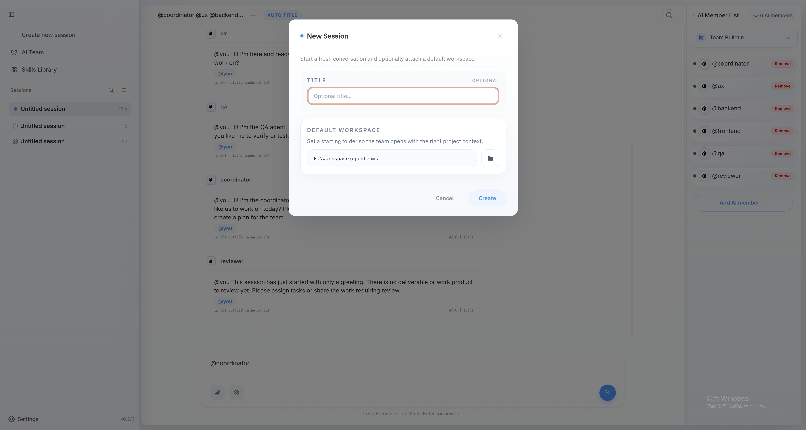
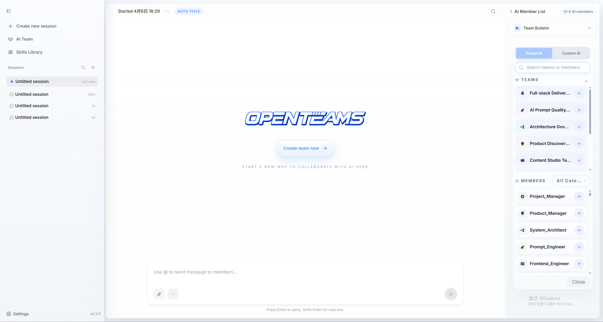
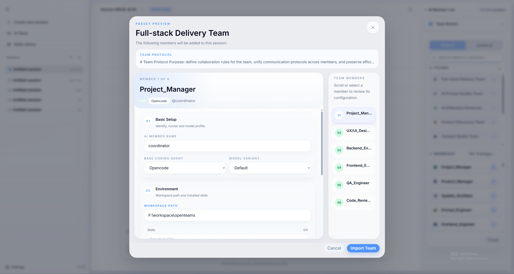
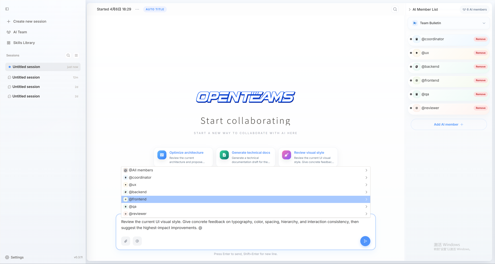

## Systèmes supportés
- Windows
- macOS (Intel et Apple Silicon)
- Linux

## Prérequis
Avant d'utiliser openteams, assurez-vous d'avoir accès à un grand modèle de langage. Vous pouvez vous référer à la [documentation de configuration des fournisseurs de modèles](/fr/custom-providers) pour configurer les clés API dans openteams.

Si vous utilisez déjà ou prévoyez d'utiliser d'autres agents de codage, assurez-vous qu'ils sont correctement installés et authentifiés. openteams supporte actuellement 10 types d'[agents de codage](/fr/supported-coding-agents). Voici les méthodes d'installation des agents les plus courants :

| Agent | Commande d'installation |
|-------|-------------|
| [Claude Code](https://docs.anthropic.com/en/docs/claude-code) | `npm install -g @anthropic-ai/claude-code` |
| [Gemini CLI](https://github.com/google-gemini/gemini-cli) | `npm install -g @google/gemini-cli` |
| [Codex](https://github.com/openai/codex) | `npm install -g @openai/codex` |
| [OpenCode](https://github.com/anomalyco/opencode) | `npm install -g opencode-ai@latest` |

<Tip>
Vous pouvez vous référer à la documentation officielle de chaque agent pour l'installation.
</Tip>

## Installation

<Tabs>
  <Tab title="Windows">
    **Option 1 : Utiliser npx**

    ```bash
    npx openteams-web
    ```

    **Option 2 : Installateur desktop (recommandé)**

    Téléchargez le dernier installateur (`.msi`) :

    <a href="https://github.com/openteams-lab/openteams/releases/latest" target="_blank" rel="noopener noreferrer">
      
    </a>

    Une fois l'installation terminée, lancez directement **openteams**.
  </Tab>

  <Tab title="macOS">
    **Lancer avec npx**

    ```bash
    npx openteams-web
    ```
  </Tab>

  <Tab title="Linux">
    **Option 1 : Utiliser npx (recommandé)**

    ```bash
    npx openteams-web
    ```

    **Option 2 : Installateur desktop**

    Téléchargez le package Linux depuis les Releases :
    <a href="https://github.com/openteams-lab/openteams/releases/latest" target="_blank" rel="noopener noreferrer">
      
    </a>

     Commande d'installation `.deb` :

    ```bash
    sudo apt install ./openteams-*.deb
    ```

  </Tab>
</Tabs>

## Démonstration de démarrage rapide
Voici un aperçu vidéo rapide montrant comment créer une session, importer une équipe et commencer à collaborer dans openteams :

<video
  src="../images/en/quick_demo.mp4"
   autoPlay
   loop
   muted
   playsInline/>

## Guide de démarrage rapide

<Steps>

<Step title="Lancer openteams">
  Choisissez une méthode de lancement :

  **Option 1 : Via l'installateur desktop**
  Ouvrez **openteams** depuis le menu des applications.

  **Option 2 : Via npx**
  ```bash
  npx openteams-web
  ```
  <Note>
  Le système utilisera openteams-cli comme agent de base par défaut. Pour accéder normalement aux modèles, vous devez configurer les API dans la [configuration des fournisseurs de modèles](/fr/custom-providers).
    Vous pouvez également utiliser d'autres agents — consultez les [agents de codage supportés](/fr/supported-coding-agents) pour les détails. Assurez-vous qu'ils sont correctement installés et authentifiés avant utilisation.
  </Note>
</Step>

<Step title="Créer une session">
  Après le lancement, cliquez sur le bouton « Nouvelle session », saisissez le nom de la session et sélectionnez un chemin d'espace de travail par défaut.
  Ce n'est pas obligatoire — vous pouvez passer cette étape, auquel cas le titre de la session et l'espace de travail par défaut conserveront leurs valeurs par défaut.

  

  <Note>
  L'espace de travail par défaut est le chemin de travail par défaut pour tous les membres IA de cette session. Vous pouvez définir un chemin d'espace de travail individuel pour chaque membre dans la configuration d'équipe, et cette configuration est prioritaire sur l'espace de travail par défaut de la session.
  </Note>
</Step>

<Step title="Créer une équipe">
  Cliquez sur le bouton « Créer une équipe maintenant », sélectionnez une équipe prédéfinie adaptée à votre tâche, ou ajoutez des membres IA prédéfinis et personnalisés pour constituer votre propre équipe dédiée.
  

  En prenant l'équipe de livraison full-stack comme exemple, l'équipe comprend des rôles tels que chef de projet, développeur frontend, développeur backend, ingénieur QA, designer UI, etc., capables de collaborer pour livrer un projet complet.
  Vous devez configurer le modèle, le chemin de travail et les compétences pour chaque membre — ou vous pouvez garder la configuration par défaut et les utiliser directement.
  
</Step>

<Step title="Commencer à collaborer">
  Vous avez réussi à convoquer les membres de votre équipe IA — maintenant faites-les travailler ! Vous pouvez saisir directement un message dans la zone de saisie et l'envoyer aux membres de l'équipe via @.
  
  Par exemple, vous pouvez @chef de projet pour envoyer un message et assigner des tâches, ou @développeur frontend pour lui demander d'écrire le code d'une page de connexion.

</Step>
</Steps>

<Tip>
Félicitations, vous maîtrisez maintenant les bases d'openteams !

Vous pouvez créer différents types d'équipes selon vos besoins pour accomplir diverses tâches. Continuez à lire les chapitres suivants pour découvrir davantage de fonctionnalités.
</Tip>

## Prochaines étapes

<CardGroup cols={2}>
  <Card title="Gérer l'équipe" icon="users" href="/fr/advanced-usage/create-team">
    Gérez votre équipe IA pour maximiser l'efficacité collaborative
  </Card>

  <Card title="Utiliser les compétences" icon="brain" href="/fr/advanced-usage/skills">
    Configurez des compétences puissantes pour vos membres IA
  </Card>
</CardGroup>

