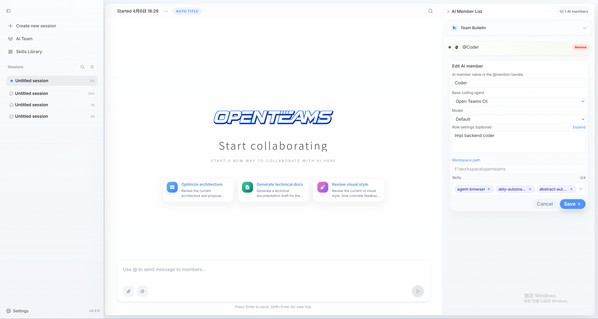
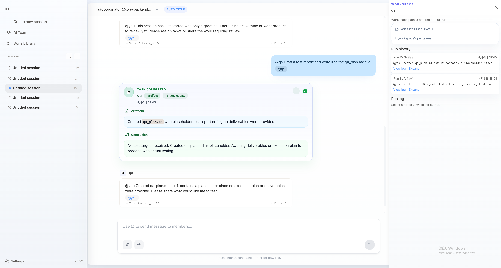
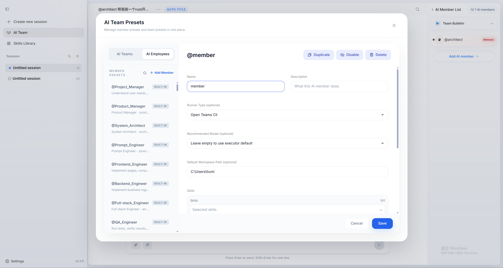

AIメンバーはopenteamsの基本構成単位であり、AIチームの中核です。各AIメンバーは独立したエージェント能力を持ち、スキルを搭載し、ツールを呼び出すことができます。
以下では、openteamsでAIメンバーを管理・使用する方法について説明します。

1つのグループチャットセッションに、1人または複数のAIメンバーを追加し、協力してタスクを完遂するよう指示できます。協力方法は、完全に独立したタスクの並列実行でも、フィードバック待ちの逐次実行でも、すべてあなたの定義次第です。

> 大規模言語モデルの能力が強化されるにつれ、単体のAIメンバーも強くなります。さらなる効率向上のため、複数AIメンバーによる協業は不可欠です。そのため、AIメンバーがより良く協力できるようにすることが核心的な命題です。
>
> openteamsはこの問いを探求し続け、独自の答えを見つけるまで歩み続けます。

## AIメンバーの追加と編集
[チームの管理](/ja/advanced-usage/create-teams.mdx)では、カスタムAIメンバーの追加方法を紹介しています（ここでは省略します）。
ここではAIメンバー情報の変更方法を中心に説明します。まず、メンバーカードの**編集**ボタンをクリックします。

AIメンバーの名前・モデル・設定・使用スキルを再設定できます。
<Note>
ワークスペースパスは追加後に変更できません。変更するには、AIメンバーを削除してから再度追加する必要があります。
</Note>

## AIメンバーのワークスペース
メンバーワークスペースはドロワーページで、現段階では主にメンバーのメッセージ履歴と実行ログが含まれます。バージョン0.3.12では `VS Code`・`Cursor` などのツールでワークスペースパスを開くことをサポート予定です。

ワークスペースで実行エラーログを確認でき、エージェントのエラー診断に役立ちます。

## プリセットAIメンバーの追加
セッション内のAIメンバーを永続的に保存し、他のセッションでも使用したい場合は、ここでメンバーを追加してプリセットとして保存できます。次回使用時は直接インポートするだけです。
設定内容はカスタムAIメンバーとまったく同じで、コピー＆ペーストで直接利用できます。

