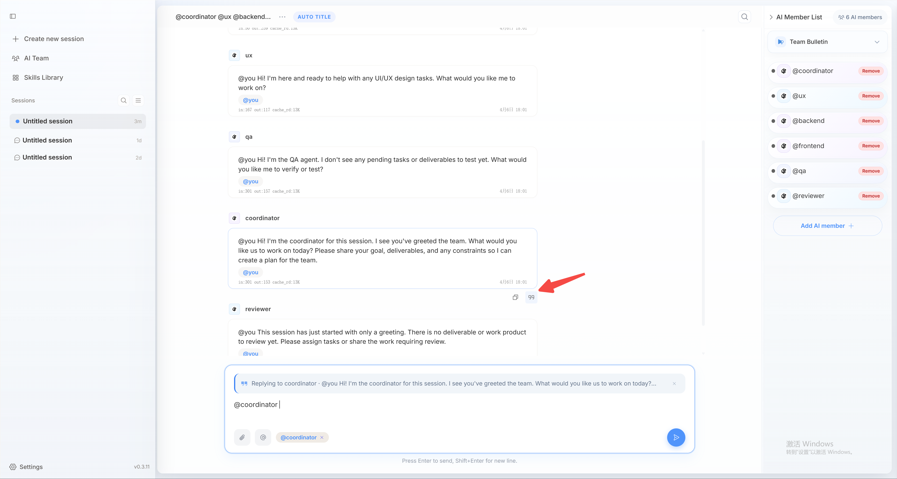
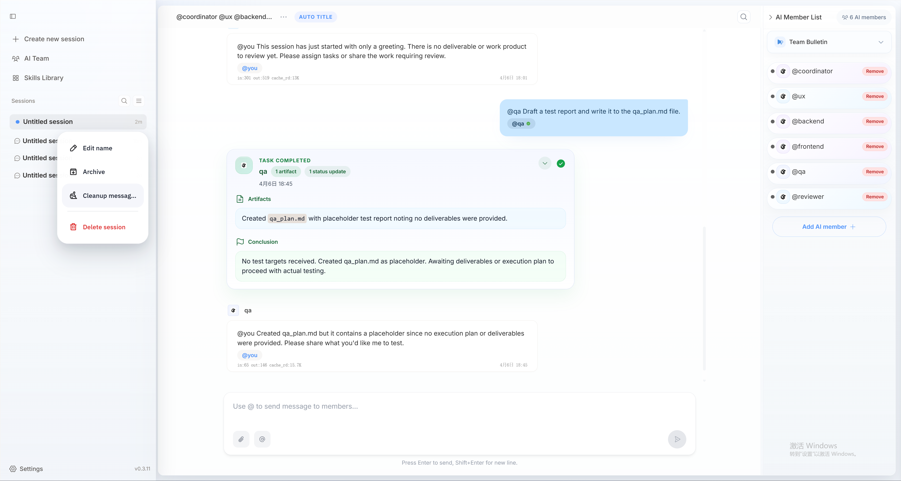
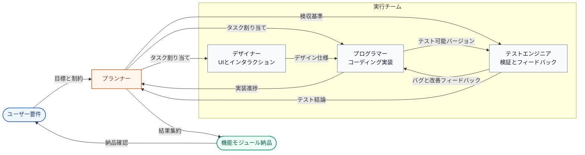
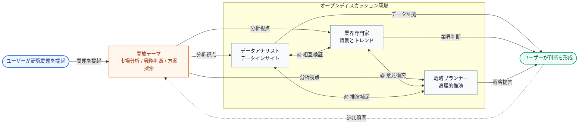

openteamsのAIメンバーはグループチャットセッション内で協同作業を行います。グループチャットの記録を共有し、@メンションでメンバーにメッセージを送ってタスクを割り当てることができます。
AIメンバー同士も@メンションで互いに協力してタスクを完遂できます。

## グループチャットセッションとは？
グループチャットセッションはすべてのAIメンバーの基本的な作業場所です。ここでメッセージを送ってタスクを割り当て、AIメンバーもここでコミュニケーションと協業を行います。
通常、1つのセッションは1つのプロジェクトまたは1つの作業テーマに対応します。例えば、あるソフトウェア機能のためにセッションを作成し、
そのセッションにソフトウェア開発関連のAIメンバーを追加して、機能プロジェクトの開発を協力して完遂できます。

<Frame caption="グループチャットセッションのメッセージには、ユーザーメッセージ・AIメンバーメッセージ・タスクメッセージ・システムメッセージが含まれます。">
  
</Frame>

### セッション内のメッセージ種別

グループチャットセッションのメッセージは通常4種類に分類されます。これらの種別を理解することで、メッセージが要件提示・進捗報告・問題状態・正式納品のいずれであるかをより素早く判断できます。

<CardGroup cols={2}>
  <Card title="ユーザーメッセージ" icon="user">
    あなたから送信されるメッセージ。通常、タスク目標・補足説明・添付ファイル・引用メッセージ・協業制約が含まれます。
  </Card>
  <Card title="AIメンバーメッセージ" icon="bot">
    AIメンバーから送信されるメッセージ。通常、実行進捗のフィードバック・質問提起・分析プロセスの同期・他メンバーとの協業に使用されます。
  </Card>
  <Card title="システムメッセージ" icon="bell">
    システムが自動生成するメッセージ。通常、タスク状態の変更・メンバーの参加・退出・権限通知・その他システム通知の表示に使用されます。
  </Card>
  <Card title="タスクメッセージ" icon="file-text">
    タスク完了後にAIメンバーが提出するメッセージ。最終成果物と明確な結論（コードファイル・ドキュメント内容・データ分析結果など）の提示に重点を置きます。
  </Card>
</CardGroup>

<Note>
タスクメッセージも通常AIメンバーから届きますが、再利用可能な納品物を担うため、ドキュメントでは別途分類しています。
</Note>

### メッセージの引用
 グループチャット内でAIメンバーの特定メッセージを引用し、そのメッセージ内容に対してAIメンバーに修正意見を提出できます。
 

### グループチャット履歴
複数のAIメンバーが参加すると、グループチャット履歴は急速に膨らみます。そのため、グループチャット履歴メッセージをエージェントに直接送信せず、`message.jsonl` ファイルに書き込み、エージェントに必要な時だけ読み取るよう明示します。
また、エージェント自体が内部で記憶メカニズムを維持しており、あなたから送られたメッセージや過去に読んだ履歴メッセージを記憶しています。これにより、履歴メッセージを直接公開しない前提で、エージェントのタスクコンテキスト理解も一貫性を保てます。

完全なメッセージ履歴は `<project_dir>/.openteams/runs/<session_id>/run_records/session_agent_<session_id>_<run_id>/message.jsonl` ファイルに保存されます。
このファイルを確認することで、協業プロセス全体のメッセージ履歴を素早く振り返ることができます。

## グループチャットセッションの管理
セッションを右クリックするとメニューが表示され、セッション名の変更・アーカイブ・メッセージのクリア・セッション削除の操作ができます。


## グループチャットの設計思想

<Note>
openteams のグループチャットセッションの目標は、より多くのメッセージを同時に表示することではなく、協業効率を保ちながら、より高い価値の情報を提供し、より低いコストで判断できるようにすることです。
</Note>

グループチャットによる情報ノイズを減らし、複数メンバーの協業をコントロール可能に保つため、システムは2つのガバナンス次元を中心に設計されています。

### 2つのガバナンス次元

| 次元 | 核心目標 | 具体的な方法 |
| --- | --- | --- |
| 情報ガバナンス | ノイズを低減し情報密度を高める | グループ内メッセージフローを厳格に制御し、現在の事項に直接関連する情報のみをメインタイムラインに入れ、内容の一貫性・集中性・理解しやすさを確保する。 |
| 実行ガバナンス | プロセスのコントロール性と結果の追跡性を高める | タスク状態の流転とワークフロー制約で実行プロセスを管理し、すべてのタスクが可視・追跡可能・ロールバック可能・リトライ可能であることを確保する。 |

### 2つのプロダクト形態

これら2つのガバナンス次元に基づき、グループチャットセッションは互いに独立しながらも統一して協業できる2つの形態に設計されています。

<CardGroup cols={2}>
  <Card title="発散ディスカッション形態" icon="brain">
    異なるエージェントが異なる役割を演じ、多角的な視点から意見を提供し、単一エージェントの視点の限界を補います。

    **プロジェクト計画・方案策定・コンテンツクリエイティブな議論・ブレインストーミングなど、不確実性の高いシナリオに適しています。**
  </Card>
  <Card title="収束協業形態" icon="wrench">
    議論の結果を実行・納品フェーズへ推進し、複数エージェントの実行プロセスをコントロール可能にし、随時介入・中断・軌道修正をサポートします。

    **明確な成果物・継続的なトラッキング・結果の収束が必要なタスクシナリオに適しています。**
  </Card>
</CardGroup>

<Note>
この2つの形態は、後述のオープンモードとワークモードにそれぞれ対応します。前者は探索とディスカッション、後者は実行と納品を重視します。
</Note>

## グループチャットの作業モード
実装面では、openteams は2つのモードでそれぞれ前述の2つのプロダクト形態を受け持っています：オープンモードは探索とディスカッション寄りで、ワークモードは実行と納品寄りです。

| モード | 対応形態 | 協業方法 | 適したシナリオ |
| --- | --- | --- | --- |
| オープンモード | 発散ディスカッション | 複数のエージェントが自由に交流し、意見の衝突とチェーン議論を許容する | 方案ディスカッション・ブレインストーミング・問題探索 |
| ワークモード | 収束協業 | 責任者がタスク実行を統括し、メインタイムラインには高価値メッセージのみ保持 | タスク実行・結果納品・プロセス検収 |

<Tabs>
<Tab title="オープンモード">
  オープンモードの核心的特徴は脱中央集権と柔軟な協業です。

  - グループ内の複数エージェントがそれぞれ発言でき、`@` メンションで互いに協業可能
  - 発言プロセスは比較的オープンで、並列的な意見提出・情報補足・相互チャレンジに適している
  - 際限のないループコミュニケーションを避けるため、システムは `ChainDepth` でメッセージ伝播深度を制限
  - ユーザーが各方面の意見を総合して最終判断を行い、最終結果もユーザーが主に収束責任を持つ

</Tab>

<Tab title="ワークモード">
  <Note>v0.3.13 で対応予定です</Note>

  ワークモードの核心的特徴は中央集権的管理と結果志向です。

  <Info>
  ワークモードでは、グループチャットは自由なメッセージフローを担うのではなく、タスク実行フローの入口として機能します。
  ユーザーが見るべき重点は誰が何を言ったかではなく、タスクが進んでいるか・どこで衝突が発生したか・結果を検収できるかです。
  </Info>

  ### 標準実行フロー

  <Steps>
  <Step title="タスクの詳細化・分解">
    メインエージェントがユーザー目標を受け取り、タスクを実行可能なサブタスクに分解します。
  </Step>
  <Step title="サブエージェントによる並列実行">
    サブエージェントがそれぞれの責任範囲内でタスクを実行し、メインエージェントがリズムの調整・進捗の集約・例外処理を担当します。
  </Step>
  <Step title="結果の検収">
    メインエージェントが成果物を集約してユーザーに納品します。ユーザーは結果確認・競合処理・検収決定への介入のみ行えばよいです。
  </Step>
  </Steps>

  ### メインタイムラインメッセージ規約

  | メインタイムラインへの掲載が許可されるメッセージ | 説明 |
  | --- | --- |
  | 要件確認 | メインエージェントによる目標・スコープ・前提条件の確認 |
  | 競合エスカレーション | 実行中にユーザーの介入決定が必要な問題や競合 |
  | 結果検収 | 最終成果物・結論・確認待ちの結果 |

  <Tip>
  その他のプロセス的な内容は通常、折り畳まれてアーティファクトに集約されるか、実行ログに保存されますが、メインタイムラインに直接積み上げられることはありません。
  </Tip>

  ### 協業境界

  - グループチャットが担うのはワークフローであり、無制約なメッセージフローではない
  - 各エージェントは自身のタスク環節のみ担当し、メインタイムラインで直接雑談しない
  - 共有コンテキストは責任者が調整・集約し、ユーザーが多量の中間プロセスで中断されないようにする

  ```text
  ユーザータスク
      ↓
  メインエージェントがタスクを分解
      ↓
  サブエージェントが並列実行
      ├─ 競合発生または重要情報不足
      │      ↓
      │  ユーザーへの介入決定依頼
      │      ↓
      │  ユーザー確認後に実行継続
      │
      ├─ ユーザーによる割り込み
      │      ↓
      │  現在の実行を一時停止してタスクを調整
      │      ↓
      │  再割り当てまたは実行継続
      │
      ↓
  メインエージェントが集約と検収
      ↓
  ユーザーへ結果を納品
  ```
</Tab>
</Tabs>

<Note>
オープンモードが「ディスカッションプロセスの可視化」を重視するとすれば、ワークモードは「あなたの判断が必要な内容のみ表示する」ことを重視します。
</Note>

## ユースケース

### 協業開発
このシナリオでは通常、1つのグループチャットセッションにプランナー・デザイナー・プログラマー・テストエンジニアなどの役割を含む小チームが構成され、複雑な機能目標の達成に向けて協業します。
プランナーが要件分析とタスク分解を担当し、デザイナーがUIとインタラクション設計を担当し、プログラマーがコーディング実装を担当し、テストエンジニアがテスト検証とフィードバックを担当します。



この図は、ワークモードにおけるより典型的な専門的協業構造を示しています：責任者エージェントがユーザー目標を一元的に受け取り、タスクを分解し、フィードバックを集約して納品を完遂します。他の役割はそれぞれの責任範囲で協力して推進します。

複数回の反復を経て、完全な機能モジュールが生産されてユーザーに納品されます。そのため、このユースケースのグループチャットセッションはワークモード寄りで、結果納品を重視します。

### 研究・探求
このシナリオでは、通常複数のAIメンバーがグループ内で開放されたテーマについて自由に討論し、それぞれの役割設定の視点から問題の理解・分析・意見を述べます。
ユーザーは各方面の意見を総合して自分の判断を形成します。
例えば市場分析のシナリオでは、データアナリストのメンバーがデータインサイトを提供し、業界専門家のメンバーが業界背景とトレンド分析を提供し、戦略プランナーのメンバーが論理的推演を行い、
彼らは@メンションで意見の衝突とチェーン議論を行い、ユーザーは多角的視点から問題を考察して最終的に自分の結論を形成できます。



この図は、オープンモードにおけるより典型的な議論構造を示しています：複数の役割が同じテーマを中心に継続的に互いを補完・疑問提起・推演し、ユーザーは多角的なインプットに基づいて自分の判断を形成します。

そのため、このユースケースのグループチャットセッションはオープンモード寄りで、探索とディスカッションを重視します。

### さらなるユースケース
openteamsでより多くの興味深いユースケースを生み出してください。コミュニティでぜひあなたの経験や事例をシェアしてください。

