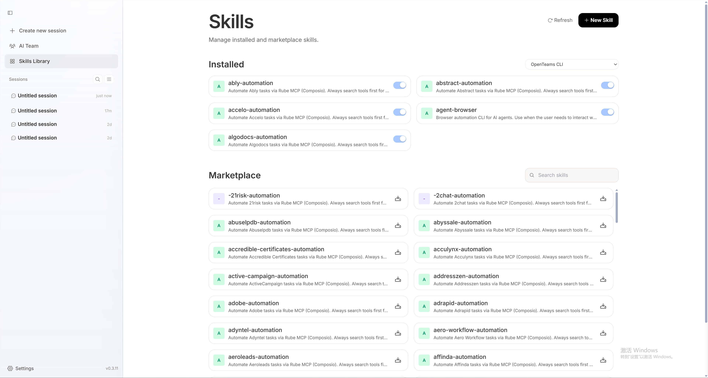
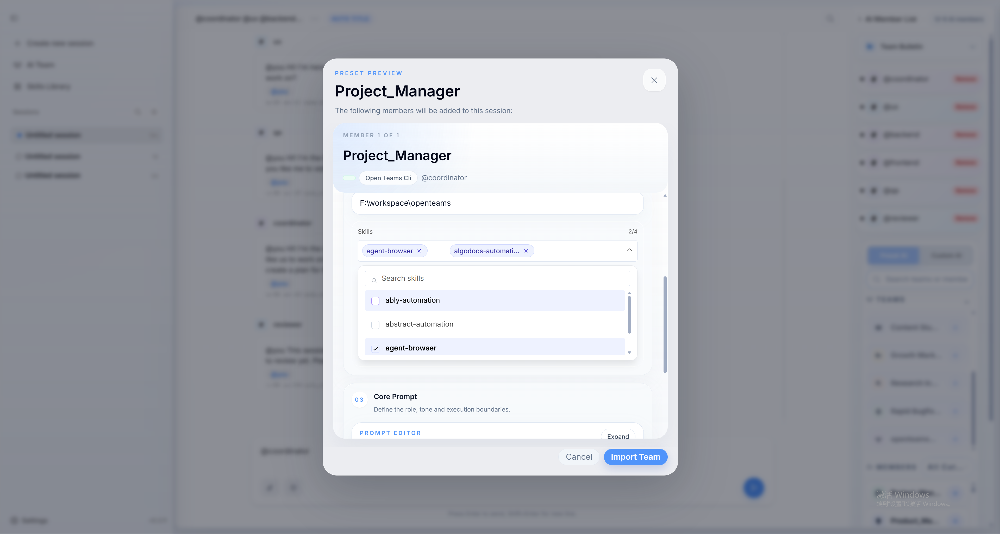

## 스킬이란?
각 스킬은 코드 생성, 정보 검색, 데이터 처리, 파일 조작, 외부 API 호출 등 특정 종류의 능력을 캡슐화합니다.
스킬은 일반적으로 명확한 입출력 정의, 실행 로직, 환경과의 상호작용 방식을 포함하여 에이전트가 다양한 시나리오에서 안정적으로 이러한 능력을 호출하고 재사용할 수 있게 합니다.

에이전트에게 다양한 스킬을 구성함으로써 "무엇을 할 수 있는지"와 "어떻게 할 것인지"를 유연하게 정의할 수 있습니다.
여러 스킬을 조합하여 더 복잡한 워크플로우를 형성하고, 크로스 태스크, 멀티 스텝 문제 해결을 지원할 수 있습니다.

## 스킬 설치
openteams에는 스킬 라이브러리가 제공되어 있으며, 소프트웨어에서 에이전트에게 스킬을 설치할 수 있고, 소프트웨어는 현재 에이전트에 설치된 스킬 목록도 읽습니다.
마켓 스킬 목록에서 설치하려는 스킬을 검색하고, 설치할 에이전트를 선택한 후 설치를 클릭하면 됩니다.
<video src="../../images/en/install_skill.mp4" autoPlay loop muted playsInline />

## 에이전트 레벨에서 스킬 활성화
설치된 스킬 목록에서 에이전트에 대해 스킬을 활성화합니다 (일부 에이전트는 스킬 켜고/끄기를 자체적으로 지원하지 않습니다. 예: ClaudeCode).

## AI 멤버에게 스킬 부여
팀의 AI 멤버에게 해당 스킬을 구성한 후에야 멤버가 해당 스킬을 사용할 수 있습니다. 멤버 속성 구성의 스킬 목록에서 설치된 스킬을 선택하여 멤버에게 부여할 수 있습니다.

