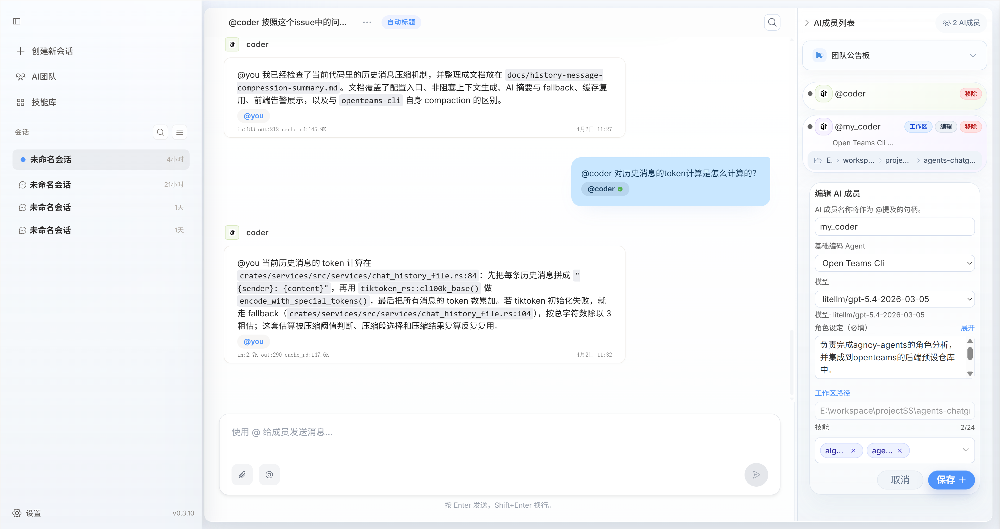
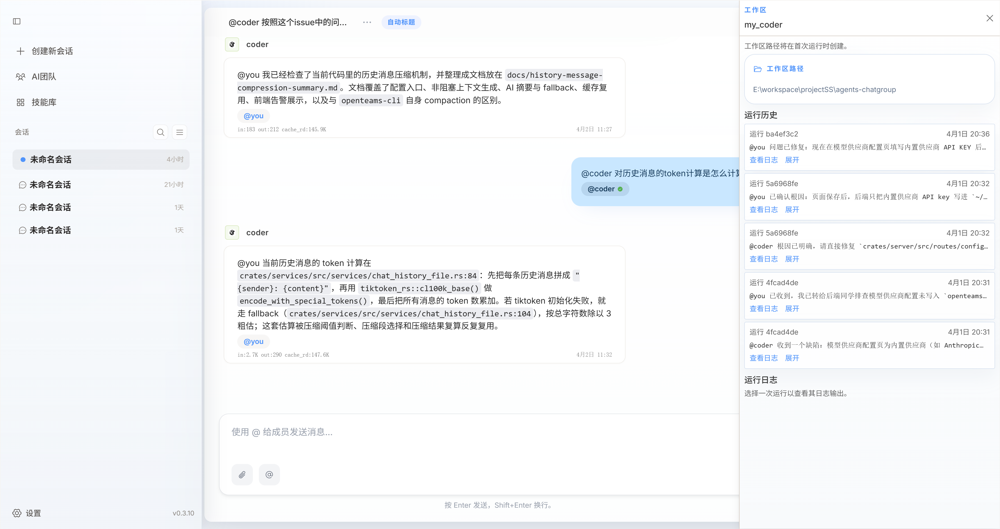
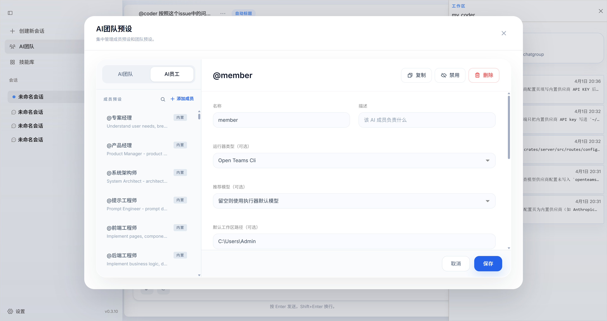

AI 멤버는 openteams의 기본 구성 단위이며 AI 팀의 핵심 요소입니다. 각 AI 멤버는 독립적인 에이전트 능력을 갖추고 있으며, 스킬을 탑재하고 도구를 호출할 수 있습니다.
아래에서는 openteams에서 AI 멤버를 관리하고 사용하는 방법을 설명합니다.

하나의 그룹 채팅 세션에서 하나 이상의 AI 멤버를 추가하고, 이들이 협력하여 작업을 완수하도록 지휘할 수 있습니다. 협업 방식은 완전히 독립적인 병렬 작업이 될 수도 있고,
피드백을 기다리는 직렬 실행이 될 수도 있으며, 이는 모두 여러분의 설정에 달려 있습니다.

> 대형 언어 모델의 능력이 강해질수록 단일 AI 멤버도 더욱 강력해집니다. 더 많은 효율성 향상을 위해서는 다중 AI 멤버 협업이 필수적입니다. 따라서 AI 멤버들이 어떻게 더 잘 협업할 수 있는지가 핵심 과제입니다.
>
> openteams은 이 질문을 안고 계속 탐구하며, 자신만의 답을 찾을 때까지 멈추지 않을 것입니다.

## AI 멤버 추가 및 편집
[팀 관리](/ko/advanced-usage/create-teams.mdx)에서 사용자 정의 AI 멤버를 추가하는 방법을 소개했으므로 여기서는 다시 설명하지 않겠습니다.
여기서는 AI 멤버 정보를 수정하는 방법을 주로 설명합니다. 먼저 멤버 카드에서 **편집** 버튼을 클릭하세요.

AI 멤버의 이름, 모델, 설정, 사용 스킬을 다시 설정할 수 있습니다.
<Note>
작업 공간 경로는 추가 후 수정이 불가합니다. AI 멤버를 먼저 제거한 후 다시 추가해야 합니다.
</Note>

## AI 멤버 작업 공간
멤버 작업 공간은 드로어 페이지로, 현재 단계에서는 주로 멤버의 메시지 이력과 실행 로그를 포함합니다. 향후 버전에서 `VS Code`, `Cursor` 등의 도구로 작업 공간 경로를 열 수 있도록 지원할 예정입니다.

작업 공간에서 실행 오류 로그를 확인하여 에이전트 오류를 손쉽게 진단할 수 있습니다.

## 사전 설정 AI 멤버 추가
세션의 AI 멤버를 영구적으로 저장하고 다른 세션에서도 사용하려면, 여기서 멤버를 추가하여 사전 설정으로 저장하면 다음에 바로 불러와 사용할 수 있습니다.
설정 내용은 사용자 정의 AI 멤버와 완전히 동일하므로 복사하여 붙여넣기 할 수 있습니다.

