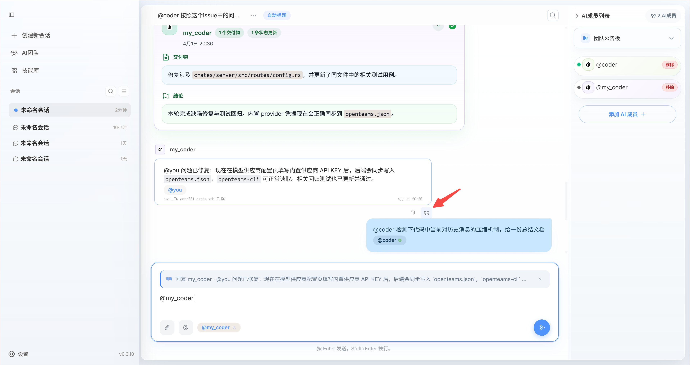
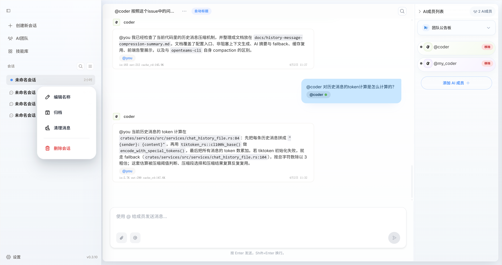
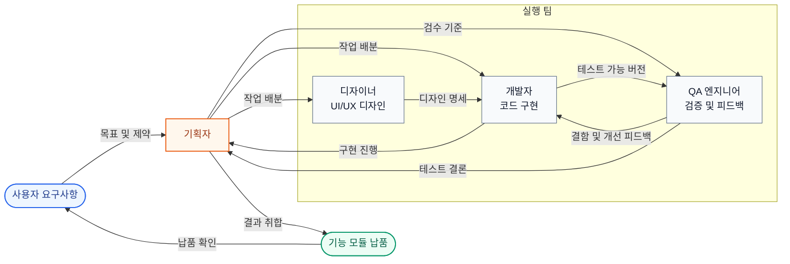
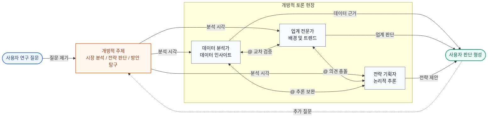

openteams의 AI 멤버들은 그룹 채팅 세션에서 협동 작업을 수행합니다. 이들은 그룹 채팅 기록을 공유하며, @를 사용하여 멤버에게 메시지를 보내 작업을 할당할 수 있고,
AI 멤버들끼리도 서로 @하여 협업으로 작업을 완수할 수 있습니다.

## 그룹 채팅 세션이란?
그룹 채팅 세션은 모든 AI 멤버의 기본 작업 공간입니다. 이곳에서 메시지를 보내 작업을 할당하고, AI 멤버들이 소통하고 협업합니다.
일반적으로 하나의 세션은 하나의 프로젝트 또는 작업 주제에 대응합니다. 예를 들어 소프트웨어 기능 개발을 위한 세션을 만들고,
그 세션에 소프트웨어 개발 관련 AI 멤버를 추가하여 해당 기능 프로젝트를 협업으로 완성할 수 있습니다.

<Frame caption="그룹 채팅 세션의 메시지에는 사용자 메시지, AI 멤버 메시지, 작업 메시지, 시스템 메시지가 포함됩니다.">
  
</Frame>

### 세션의 메시지 유형

그룹 채팅 세션의 메시지는 일반적으로 네 가지로 분류됩니다. 이 유형들을 이해하면 하나의 메시지가 요구사항 제시인지, 진행 상황 보고인지, 문제 상태인지, 아니면 공식 결과물인지 더 빠르게 파악할 수 있습니다.

<CardGroup cols={2}>
  <Card title="사용자 메시지" icon="user">
    사용자가 보내는 메시지로, 일반적으로 작업 목표, 보충 설명, 첨부 파일, 인용 메시지, 협업 제약 조건이 포함됩니다.
  </Card>
  <Card title="AI 멤버 메시지" icon="bot">
    AI 멤버가 보내는 메시지로, 일반적으로 실행 진행 상황 보고, 질문 제기, 분석 과정 동기화, 다른 멤버와의 협업에 사용됩니다.
  </Card>
  <Card title="시스템 메시지" icon="bell">
    시스템이 자동으로 생성하는 메시지로, 작업 상태 변경, 멤버 참가 또는 퇴장, 권한 알림, 기타 시스템 공지 표시에 사용됩니다.
  </Card>
  <Card title="작업 메시지" icon="file-text">
    AI 멤버가 작업 완료 후 제출하는 메시지로, 코드 파일, 문서 내용, 데이터 분석 결과 등 최종 결과물과 명확한 결론을 중점적으로 표시합니다.
  </Card>
</CardGroup>

<Note>
작업 메시지는 일반적으로 AI 멤버에게서도 오지만, 재사용 가능한 결과물을 담고 있기 때문에 문서에서 별도로 분류합니다.
</Note>

### 메시지 인용
그룹 채팅에서 AI 멤버의 특정 메시지를 인용하여, 해당 메시지 내용에 대한 수정 의견을 AI 멤버에게 제출할 수 있습니다.


### 그룹 채팅 이력
여러 AI 멤버가 참여하면 그룹 채팅 이력이 빠르게 늘어납니다. 따라서 그룹 채팅 이력 메시지를 에이전트에게 직접 보내는 대신, `message.jsonl` 파일에 기록하고 필요할 때 에이전트가 읽도록 명시적으로 알려줍니다.
또한 에이전트 자체적으로 기억 메커니즘을 유지하여, 사용자가 보낸 메시지와 이전에 읽은 이력 메시지를 기억합니다. 이를 통해 이력 메시지를 직접 노출하지 않으면서도 에이전트가 작업의 컨텍스트를 일관되게 이해할 수 있습니다.

전체 메시지 이력은 `<project_dir>/.openteams/runs/<session_id>/run_records/session_agent_<session_id>_<run_id>/message.jsonl` 파일에 저장됩니다.
이 파일을 통해 전체 협업 과정의 메시지 이력을 빠르게 검토할 수 있습니다.

## 그룹 채팅 세션 관리
세션 하나를 오른쪽 클릭하면 메뉴가 나타나며, 세션 이름 변경, 세션 보관, 세션 메시지 정리, 세션 삭제 작업을 수행할 수 있습니다.


## 그룹 채팅 설계 철학

<Note>
openteams 그룹 채팅 세션의 목표는 더 많은 메시지를 동시에 표시하는 것이 아니라, 협업 효율성을 보장하면서 더 가치 있는 정보를 보여주고 더 낮은 비용으로 판단할 수 있게 하는 것입니다.
</Note>

그룹 채팅이 가져오는 정보 노이즈를 줄이고 다중 멤버 협업을 제어 가능하게 유지하기 위해, 시스템은 두 가지 거버넌스 차원을 중심으로 설계되었습니다.

### 두 가지 거버넌스 차원

| 차원 | 핵심 목표 | 구체적 방법 |
| --- | --- | --- |
| 정보 거버넌스 | 노이즈 감소, 정보 밀도 향상 | 그룹 내 메시지 흐름을 엄격히 제어하여, 현재 업무와 직접 관련된 정보만 주 타임라인에 진입시켜 내용의 일관성, 집중성 및 이해도를 보장합니다. |
| 실행 거버넌스 | 프로세스 제어성 및 결과 추적성 향상 | 작업 상태 전환과 워크플로우 제약을 통해 실행 과정을 관리하여, 모든 작업이 가시적이고 추적 가능하며 롤백 및 재시도가 가능하도록 합니다. |

### 두 가지 제품 형태

이 두 거버넌스 차원을 기반으로, 그룹 채팅 세션은 서로 독립적이지만 통합적으로 협업할 수 있는 두 가지 형태로 설계됩니다.

<CardGroup cols={2}>
  <Card title="발산적 토론 형태" icon="brain">
    서로 다른 에이전트가 다양한 역할을 맡아 다각적인 의견을 제공하여 단일 에이전트의 시각적 한계를 보완합니다.

    **프로젝트 계획, 방안 수립, 콘텐츠 기획, 브레인스토밍 등 불확실성이 높은 시나리오에 적합합니다.**
  </Card>
  <Card title="수렴적 협업 형태" icon="wrench">
    토론 결과를 실행 및 납품 단계로 추진하며, 다중 에이전트의 실행 과정을 제어 가능하게 하고 언제든 개입, 중단, 교정을 지원합니다.

    **명확한 산출물, 지속적인 추적, 결과 수렴이 필요한 작업 시나리오에 적합합니다.**
  </Card>
</CardGroup>

<Note>
이 두 가지 형태는 각각 이후에 소개될 개방 모드와 작업 모드에 해당합니다. 전자는 탐색과 토론을 강조하고, 후자는 실행과 납품을 강조합니다.
</Note>

## 그룹 채팅 작업 모드
구현 측면에서 openteams은 두 가지 모드로 앞서 말한 두 가지 제품 형태를 각각 담당합니다: 개방 모드는 탐색과 토론에 적합하고, 작업 모드는 실행과 납품에 적합합니다.

| 모드 | 대응 형태 | 협업 방식 | 적합한 시나리오 |
| --- | --- | --- | --- |
| 개방 모드 | 발산적 토론 | 여러 에이전트가 자유롭게 교류하며 의견 충돌과 연쇄 토론을 허용 | 방안 토론, 브레인스토밍, 문제 탐구 |
| 작업 모드 | 수렴적 협업 | 담당자가 작업 실행을 총괄하며, 주 타임라인에는 고가치 메시지만 유지 | 작업 실행, 결과 납품, 프로세스 검수 |

<Tabs>
<Tab title="개방 모드">
  개방 모드의 핵심 특징은 탈중앙화와 유연한 협업입니다.

  - 그룹 내 여러 에이전트가 각자 발언하거나 `@`로 서로 협업할 수 있습니다
  - 발언 과정이 비교적 개방적이어서 의견 병렬 제시, 정보 보충, 상호 검증에 적합합니다
  - 끝없는 순환 소통을 방지하기 위해 시스템은 `ChainDepth`로 메시지 전파 깊이를 제한합니다
  - 사용자가 각 의견을 종합하여 최종 판단을 내려야 하며, 최종 결과도 주로 사용자가 수렴합니다

</Tab>

<Tab title="작업 모드">
  <Note>v0.3.12 버전에서 지원될 예정입니다</Note>

  작업 모드의 핵심 특징은 중앙화 관리와 결과 지향입니다.

  <Info>
  작업 모드에서 그룹 채팅은 더 이상 자유로운 메시지 흐름을 담지 않으며, 작업 실행 흐름의 입구 역할을 합니다.
  사용자가 보는 중점은 더 이상 누가 무엇을 말했는가가 아니라, 작업이 진행되고 있는지, 어디서 충돌이 발생했는지, 결과를 수락할 수 있는지입니다.
  </Info>

  ### 표준 실행 프로세스

  <Steps>
  <Step title="작업 세부 분할">
    주 에이전트가 사용자 목표를 받아 작업을 실행 가능한 하위 작업으로 분할합니다.
  </Step>
  <Step title="하위 에이전트 병렬 실행">
    하위 에이전트들이 각자의 책임 범위 내에서 작업을 실행하고, 주 에이전트가 리듬 조율, 진행 상황 취합, 예외 처리를 담당합니다.
  </Step>
  <Step title="결과 검수">
    주 에이전트가 산출물을 취합하여 사용자에게 납품하며, 사용자는 결과 확인, 충돌 처리, 검수 결정에만 개입하면 됩니다.
  </Step>
  </Steps>

  ### 주 타임라인 메시지 계약

  | 주 타임라인 진입 허용 메시지 | 설명 |
  | --- | --- |
  | 요구사항 확인 | 주 에이전트의 목표, 범위, 전제 조건 확인 |
  | 충돌 에스컬레이션 | 실행 과정에서 사용자의 개입 결정이 필요한 문제나 충돌 |
  | 결과 검수 | 최종 산출물, 결론, 확인 대기 결과 |

  <Tip>
  기타 과정적 내용은 일반적으로 접혀지거나 아티팩트로 침전되거나, 실행 로그에 보관되며, 주 타임라인에 직접 쌓이지 않습니다.
  </Tip>

  ### 협업 경계

  - 그룹 채팅은 워크플로우를 담으며, 제약 없는 메시지 흐름이 아닙니다
  - 각 에이전트는 자신의 작업 단계만 담당하며, 주 타임라인에서 직접 잡담하지 않습니다
  - 공유 컨텍스트는 담당자가 조율하고 침전시켜, 사용자가 많은 중간 과정에 방해받지 않도록 합니다

  ```text
  사용자 작업
      ↓
  주 에이전트 작업 분할
      ↓
  하위 에이전트 병렬 실행
      ├─ 충돌 발생 또는 핵심 정보 부족
      │      ↓
      │  사용자 개입 결정 요청
      │      ↓
      │  사용자 확인 후 실행 계속
      │
      ├─ 사용자 능동적 중단
      │      ↓
      │  현재 실행 일시 정지 및 작업 조정
      │      ↓
      │  재분배 또는 실행 계속
      │
      ↓
  주 에이전트 취합 및 검수
      ↓
  사용자에게 결과 납품
  ```
</Tab>
</Tabs>

<Note>
개방 모드가 "토론 과정을 보는 것"을 강조한다면, 작업 모드는 "당신이 결정해야 할 내용만 보는 것"을 강조합니다.
</Note>

## 사용 시나리오

### 협업 개발
이 시나리오에서는 일반적으로 하나의 그룹 채팅 세션에 기획자, 디자이너, 개발자, QA 엔지니어 등의 역할을 포함하는 소규모 팀이 복잡한 기능 목표를 협업으로 달성합니다.
기획자는 요구사항 분석과 작업 분할을 담당하고, 디자이너는 UI/UX 디자인을 담당하며, 개발자는 코드 구현을 담당하고, QA 엔지니어는 테스트 검증 및 피드백을 담당합니다.



이 그림은 작업 모드의 더 전형적인 전문 협업 구조를 보여줍니다: 담당 에이전트가 사용자 목표를 일괄 수용하여 작업을 분할하고 피드백을 취합하며 납품을 완료하고, 다른 역할들은 각자의 책임에 따라 협력하여 추진합니다.

여러 차례의 반복 후 완전한 기능 모듈이 사용자에게 납품됩니다. 따라서 이 사용 시나리오의 그룹 채팅 세션은 작업 모드 지향으로, 결과 납품을 강조합니다.

### 연구 토론
이 시나리오에서는 일반적으로 여러 AI 멤버가 그룹 내에서 하나의 개방적인 주제에 대해 자유롭게 토론하며, 각자의 역할 설정 시각에서 문제에 대한 이해, 분석, 견해를 표명합니다.
사용자는 옆에서 각 의견을 종합하여 자신의 판단을 형성합니다.
예를 들어 시장 분석 시나리오에서는 데이터 분석가 멤버가 데이터 인사이트를 제공하고,
업계 전문가 멤버가 업계 배경과 트렌드 분석을 제공하며, 전략 기획자 멤버가 논리적 추론을 수행합니다.
이들은 서로 @하여 의견을 교환하고 연쇄 토론을 벌이며, 사용자는 다양한 각도에서 문제를 바라보고 최종적으로 자신의 결론을 형성합니다.



이 그림은 개방 모드의 더 전형적인 토론 구조를 보여줍니다: 여러 역할이 동일한 주제를 중심으로 지속적으로 서로 보완하고, 의문을 제기하며, 추론하는 가운데, 사용자는 다각적인 입력을 기반으로 자신의 판단을 형성합니다.

따라서 이 사용 시나리오의 그룹 채팅 세션은 개방 모드 지향으로, 탐색과 토론을 강조합니다.

### 더 많은 사용 시나리오
openteams으로 더 많은 흥미로운 사용 시나리오를 만들어보시고, 커뮤니티에서 경험과 사례를 공유해 주세요.
