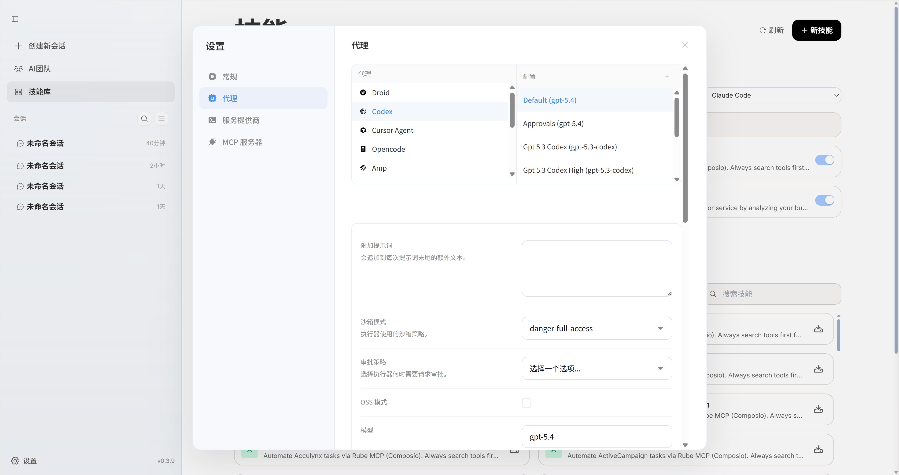
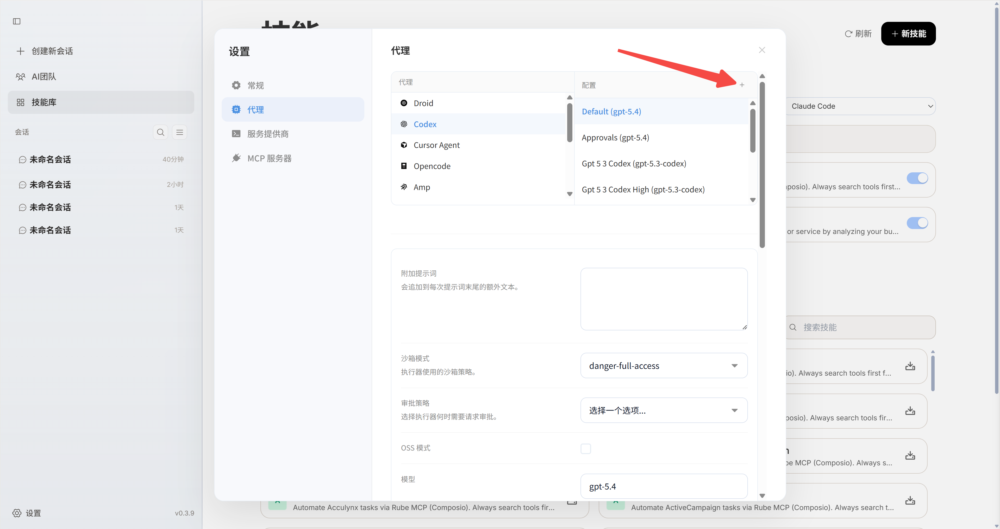
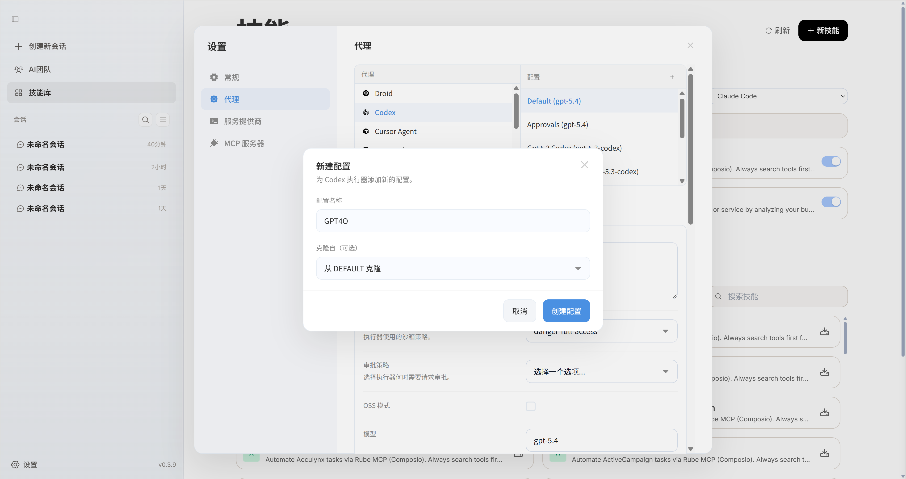
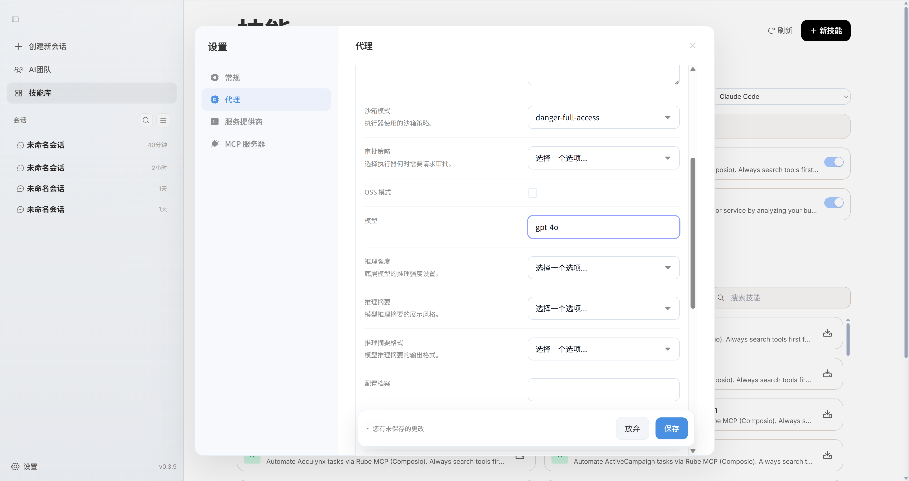

## 添加代理配置
您的代理Agent可能支持了新模型，或者您想使用的模型在内置配置中没有，因此您可以在代理配置中添加新的模型配置。
（OpenTeamsCli的模型配置会自动同步服务供应商中的模型，您无需手动配置）

<Steps>
<Step>
进入`设置->代理`设置页面

</Step>
<Step>
选择您要添加模型配置的代理，点击配置+按钮

</Step>
<Step>
新建一个配置，输入配置名称

</Step>
<Step>
填写号配置信息，最重要的就是**模型名称**，这个必须填写正确否则Agent无法访问模型

</Step>
</Steps>