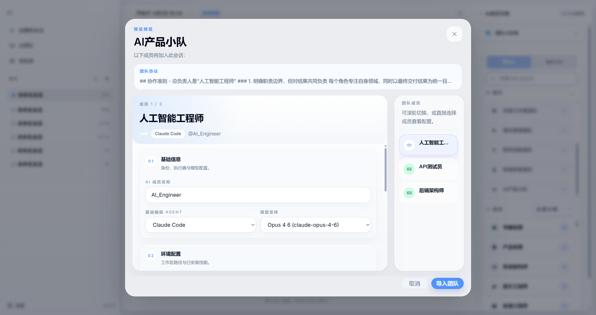

## 内置AI成员
openteams不认为AI只是一个工具，而是将AI作为团队成员来管理，AI成员是openteams的基本组成单元。

我们相信随着AI能力的提升，AI能独立完成更多工作，因此在openteams中，每个AI成员都应该有自己的角色职责、专属技能和工作区，您可以给他们配置适合其职责的模型，
让他们可以更好地在团队协作中完成任务。

我们为openteams预设了160个内置AI成员，涵盖了开发、内容创作、营销、运营、数据分析等多个领域的常见角色职责，
您可以直接使用这些内置成员来组建团队，也可以在此基础上进行修改，或者添加自定义AI成员来满足您的需求。

当前openteams内置的AI成员来自于开源项目[Agency-Agents](https://github.com/msitarzewski/agency-agents)，我们对这些成员进行了重新设计和配置，以更好地适应openteams的团队协作模式，
并且我们会持续优化和增加更多实用的内置AI成员，敬请期待。

您可以在预设AI成员列表中将最合适您当前使用场景的AI成员添加到会话中。
<video src="../../images/zh/member_import.mp4" autoPlay loop muted playsInline />

## 添加自定义AI成员
您可以在会话中直接创建自定义AI成员，您需要填写成员名称、选择使用的Agent和模型，设定成员职责，填写工作区路径，设置专属技能。
<video src="../../images/zh/custom_member_zh.mp4" autoPlay loop muted playsInline />

如果您的自定义AI成员需要在多个会话群中使用，我们推荐您添加全局自定义AI成员，这样您就可以在不同会话中直接导入使用，无需重复创建。
<video src="../../images/zh/create_preset_ai_member.mp4" autoPlay loop muted playsInline />

## 制定团队准则
团队准则用于限定成员在团队中的协作方式，例如您可以要求只允许一个AI和您进行对话，其余AI成员只能执行任务禁止发消息；或者
您也可以禁止AI成员之间互相交流，只能回复用户消息，这完全取决于您对团队协作方式的设定。

<Note>
请注意，团队准则是一个弱约束，现在并没有在系统层面保证准则一定生效，而是依靠AI成员的自我约束来执行。
</Note>

## 创建自定义团队
AI团队是openteams的核心功能，我们支持您在软件中创建自己的AI团队完成工作任务。
操作十分简单，您需要为团队命名，设定团队准则，添加AI成员，最后保存您的团队配置，以便在需要时直接导入使用。
<video src="../../images/zh/create_custom_teams.mp4" autoPlay loop muted playsInline />

如何创建有效的团队是提高Agent协作效率的关键问题，我们目前提供了8个直接使用的AI团队，我们将持续研究并添加更多好用的预设团队。

## 使用自定义团队
创建完自定义团队后可以直接导入整个团队到会话中，您现在就可以开始协作。
