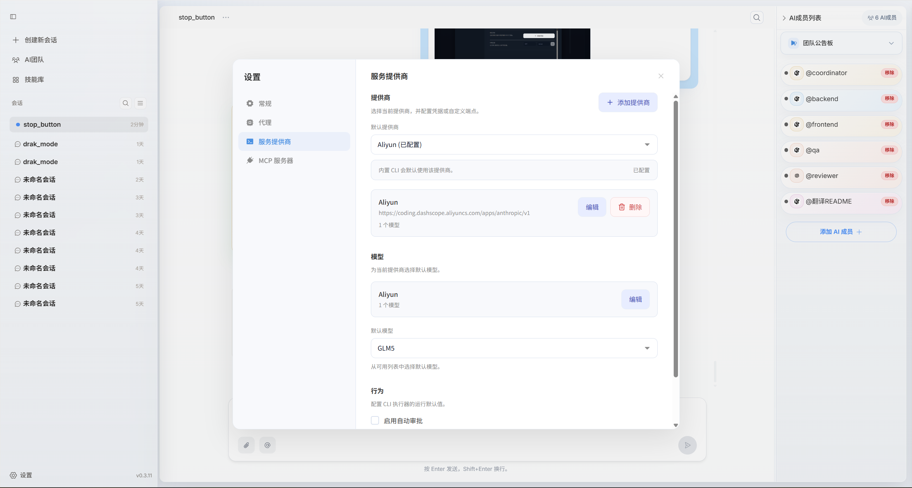

## 配置页面

在 `设置 -> 服务提供商` 中进入**服务提供商**配置区

## 配置模型供应商

<Tabs>

  <Tab title="创建自定义供应商">
  <video src="../../images/zh/config_provider.mp4" autoPlay loop muted playsInline />
    <Steps>
      <Step title="新建供应商">
        在服务供应商设置页面的右上角区域点击**添加供应商**按钮，填写供应商ID、名称与 Base URL、API Key和访问SDK。
        
      </Step>

      <Step title="配置模型并保存">
        点击**添加模型**按钮，填写模型ID、显示名称、上下文限制、输出限制、输入输出模态等信息后保存。
         
         具体的配置信息可以参考模型厂商提供的文档进行配置，上下文和输出限制为选填，如果不填则为默认值。
         ***建议按照模型推荐数值进行填写，否则会影响模型性能。***

      </Step>
    </Steps>
  </Tab>
  <Tab title="支持供应商">
  你需要填入对应模型厂商的API Key，并选择对应的模型，保存后即可在成员配置中选择使用。
    <CardGroup cols={2}>
      <Card title="OpenAI" icon="/logos/openai-logo.svg">
        支持 GPT 系列模型。配置 API Key 后即可直接使用。
      </Card>

      <Card title="Anthropic" icon="/logos/claude.svg">
        支持 Claude 系列模型。适合长上下文与复杂推理场景。
      </Card>

      <Card title="Google" icon="/logos/gemini-logo.svg">
        支持 Gemini 模型（Google AI / Vertex 生态）。
      </Card>

      <Card title="Ollama" icon="/logos/openai-logo.svg">
        支持通过Ollama部署地址接入模型服务。
      </Card>

      <Card title="OpenRouter" icon="globe">
        可统一接入多家模型供应商，并按模型灵活切换路由。
      </Card>

      <Card title="MiniMax" icon="/logos/minimax-color.svg">
        支持 Minimax 全系列模型，适合国内用户使用。
      </Card>
    </CardGroup>
  </Tab>

</Tabs>
