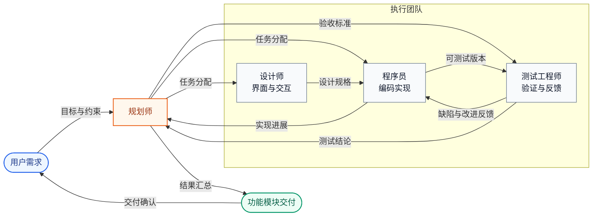
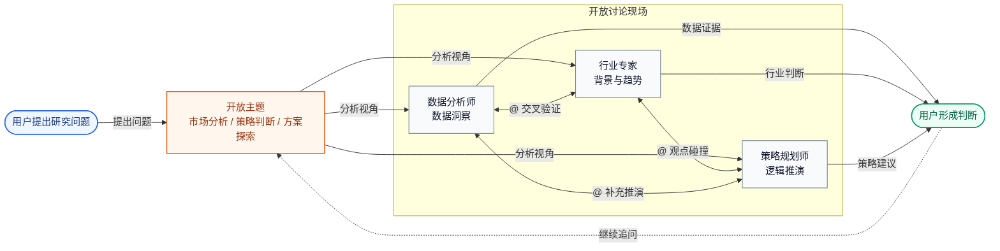

openteams中的AI成员会在一个群聊会话中完成协同工作，它们共享群聊记录，您可以使用@给成员发送消息给他们分配任务，
AI成员之间也可以相互@来协作完成任务。

## 什么是群聊会话？
群聊会话是所有AI成员的基本工作场所，我们能在这里给他们发送消息分配任务，AI成员也会在这里进行沟通和协作。
通常一个会话对应一个项目或者一个工作主题，例如您可以为一项软件功能创建一个会话，
在这个会话中添加软件开发相关的AI成员来协作完成这个功能项目的开发。

<Frame caption="群聊会话中的消息包含用户消息、AI成员消息、任务消息、系统消息。">
  
</Frame>

### 会话中的消息类型

群聊会话中的消息通常分为四类。理解这些类型后，您可以更快判断一条消息是在提需求、反馈进展、问题状态，还是正式交付结果。

<CardGroup cols={2}>
  <Card title="用户消息" icon="user">
    由您发送，通常包含任务目标、补充说明、附件文件、引用消息和协作约束。
  </Card>
  <Card title="AI 成员消息" icon="bot">
    由 AI 成员发送，通常用于反馈执行进展、提出问题、同步分析过程或与其他成员协作。
  </Card>
  <Card title="系统消息" icon="bell">
    由系统自动生成，通常用于展示任务状态变更、成员加入或退出、权限提示以及其他系统通知。
  </Card>
  <Card title="任务消息" icon="file-text">
    由 AI 成员在任务完成后提交，重点展示最终产物和明确结论，例如代码文件、文档内容或数据分析结果。
  </Card>
</CardGroup>

<Note>
任务消息虽然通常也来自 AI 成员，但它承载的是可复用的交付结果，因此在文档中单独归类。
</Note>

### 消息引用
 可以在群聊中引用AI成员的某条消息，针对这条消息的内容给AI成员提交修改意见
 

### 群聊历史
当加入多个AI成员时，群聊历史会加速膨胀，因此我们不会将群聊历史消息直接发给Agent，而是写入一个`message.jsonl`文件，并明确告诉Agent需要时再去读取。
另外Agent自身内部维护了一套记忆机制，对于您给他发送的消息和他曾读过的历史消息都会有记忆。这样保证了不直接暴露历史消息的前提下，Agent对任务的上下文理解也能保持一致。

完整的消息历史记录会保存在`<project_dir>/.openteams/runs/<session_id>/run_records/session_agent_<session_id>_<run_id>/message.jsonl`文件中，
您可以通过查看这个文件来快速回顾整个协作过程中的消息历史。

## 管理群聊会话
右键单击的一条会话，会弹出一个菜单，您可以修改会话名称、归档会话、清理会话消息、删除会话操作。


## 群聊的设计思路

<Note>
openteams 群聊会话的目标，不是让更多消息同时出现，而是在保障协作效率的前提下，让您看到更高价值的信息，并以更低的成本做出判断。
</Note>

为了减少群聊带来的信息噪声，并让多成员协作保持可控，系统重点围绕两个治理维度进行设计。

### 两个治理维度

| 维度 | 核心目标 | 具体方式 |
| --- | --- | --- |
| 信息治理 | 降低噪声，提高信息密度 | 严格控制群内消息流，只让与当前事务直接相关的信息进入主时间线，确保内容连贯、聚焦且易于理解。 |
| 执行治理 | 提高过程可控性和结果可追踪性 | 通过任务状态流转和工作流约束管理执行过程，确保每个任务都可见、可追溯、可回退、可重试。 |

### 两种产品形态

基于这两个治理维度，群聊会话被设计成两种彼此独立但可以统一协作的形态。

<CardGroup cols={2}>
  <Card title="发散讨论形态" icon="brain">
    不同 Agent 扮演不同角色，从多元视角提供意见，弥补单一 Agent 视角的局限。

    **适用于项目计划、方案制定、文案创意讨论和头脑风暴等高不确定性场景。**
  </Card>
  <Card title="收敛协作形态" icon="wrench">
    将讨论结果推进到执行和交付阶段，要求多 Agent 的执行过程可控，并支持随时介入、打断和纠偏。

    **适用于需要明确产出、持续跟踪和结果收敛的任务场景。**
  </Card>
</CardGroup>

<Note>
这两种形态分别对应后续介绍的开放模式和工作模式。前者强调探索和讨论，后者强调执行和交付。
</Note>

## 群聊工作模式
在实现层面，openteams 用两种模式分别承接前面的两种产品形态：开放模式偏向探索和讨论，工作模式偏向执行和交付。

| 模式 | 对应形态 | 协作方式 | 适合场景 |
| --- | --- | --- | --- |
| 开放模式 | 发散讨论 | 多个 Agent 自由交流，允许观点碰撞和链式讨论 | 方案讨论、头脑风暴、问题探索 |
| 工作模式 | 收敛协作 | 由负责人统筹任务执行，主时间线只保留高价值消息 | 任务落地、结果交付、过程验收 |

<Tabs>
<Tab title="开放模式">
  开放模式的核心特征是去中心化和灵活协作。

  - 群内多个 Agent 可以分别发言，也可以通过 `@` 相互协作
  - 发言过程相对开放，适合并行提出观点、补充信息和相互挑战
  - 为避免无休止的循环沟通，系统通过 `ChainDepth` 限制消息传播深度
  - 用户需要综合各方意见做最终判断，最终结果也主要由用户负责收敛

</Tab>

<Tab title="工作模式">
  工作模式的核心特征是中心化管控和结果导向。

  <Info>
  在工作模式下，群聊不再承载自由消息流，而是作为任务执行流的入口。
  用户看到的重点不再是谁说了什么，而是任务是否推进、哪里发生冲突、结果是否可以验收。
  </Info>

  ### 标准执行流程

  <Steps>
  <Step title="任务细化拆分">
    由主Agent接收用户目标，并将任务拆分成可执行的子任务。
  </Step>
  <Step title="子Agent并行执行">
    子Agent在各自职责范围内执行任务，主Agent负责协调节奏、汇总进展和处理异常。
  </Step>
  <Step title="结果验收">
    主Agent汇总产物并向用户交付，用户只需要围绕结果确认、冲突处理和验收决策进行介入。
  </Step>
  </Steps>

  ### 主时间线消息契约

  | 允许进入主时间线的消息 | 说明 |
  | --- | --- |
  | 需求确认 | 主Agent 对目标、范围、前置条件的确认 |
  | 冲突升级 | 执行过程中需要用户介入决策的问题或冲突 |
  | 结果验收 | 最终产物、结论和待确认结果 |

  <Tip>
  其他过程性内容通常会被折叠、沉淀为 artifact，或保留在执行日志中，而不是直接堆进主时间线。
  </Tip>

  ### 协作边界

  - 群聊承载的是工作流，而不是无约束的消息流
  - 每个 Agent 只负责自己的任务环节，不在主时间线中直接闲聊
  - 共享上下文通过负责人协调和沉淀，避免用户被大量中间过程打断

  ```text
  用户任务
      ↓
  主Agent拆分任务
      ↓
  子Agent并行执行
      ├─ 发生冲突或缺少关键信息
      │      ↓
      │  请求用户介入决策
      │      ↓
      │  用户确认后继续执行
      │
      ├─ 用户主动打断
      │      ↓
      │  暂停当前执行并调整任务
      │      ↓
      │  重新分配或继续执行
      │
      ↓
  主Agent汇总与验收
      ↓
  向用户交付结果
  ```
</Tab>
</Tabs>

<Note>
如果说开放模式强调“看见讨论过程”，那么工作模式强调的是“只看需要您决策的内容”。
</Note>

## 使用场景

### 协作开发
这个场景下通常一个群聊会话中会包含一个小团队：规划师、设计师、程序员、测试工程师等角色，他们围绕一个复杂功能目标进行协作。
规划师负责需求分析和任务拆分，设计师负责界面和交互设计，程序员负责编码实现，测试工程师负责测试验证反馈。



这张图展示的是工作模式下更典型的专业协作结构：由负责人 Agent 统一承接用户目标、拆分任务、汇总反馈并完成交付，其他角色围绕各自职责协同推进。

经过多轮迭代后，产出一个完整的功能模块交付给用户。因此这种使用场景下的群聊会话更倾向于工作模式，强调的是结果交付。

### 研究探讨
这种场景下，通常多个AI成员会在群内围绕一个开放主题进行自由讨论，各自从自身的角色设定角度来阐述对问题的理解、分析和观点，
用户则在旁边综合各方意见来形成自己的判断。
例如在一个市场分析的场景中，可能会有一个数据分析师成员负责提供数据洞察，
一个行业专家成员负责提供行业背景和趋势分析，一个策略规划师成员进行逻辑推演，
他们之间会相互@来进行观点碰撞和链式讨论，用户能从不同角度来看待问题，并最终形成自己的结论。



这张图展示的是开放模式下更典型的讨论结构：多个角色围绕同一个主题持续互相补充、质疑和推演，用户则基于多视角输入形成自己的判断。

因此这种使用场景下的群聊会话更倾向于开放模式，强调的是探索和讨论。

### 更多使用场景
期待您用openteams创造出更多有趣的使用场景，欢迎在社区中分享您的经验和案例。
