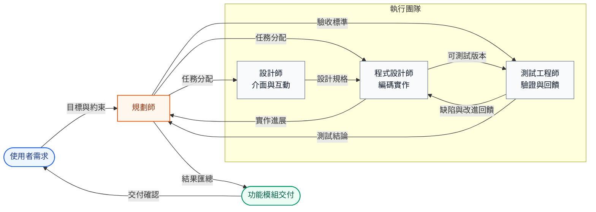
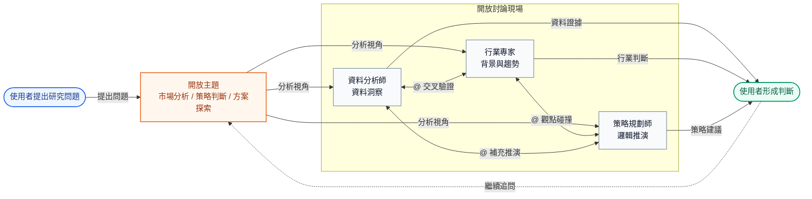

openteams 中的 AI 成員會在一個群聊會話中完成協同工作，它們共享群聊記錄，您可以使用 @ 給成員傳送訊息來分配任務，
AI 成員之間也可以相互 @ 來協作完成任務。

## 什麼是群聊會話？
群聊會話是所有 AI 成員的基本工作場所，我們能在這裡給他們傳送訊息分配任務，AI 成員也會在這裡進行溝通和協作。
通常一個會話對應一個專案或者一個工作主題，例如您可以為一項軟體功能建立一個會話，
在這個會話中新增軟體開發相關的 AI 成員來協作完成這個功能專案的開發。

<Frame caption="群聊會話中的訊息包含使用者訊息、AI 成員訊息、任務訊息、系統訊息。">
  
</Frame>

### 會話中的訊息類型

群聊會話中的訊息通常分為四類。理解這些類型後，您可以更快判斷一條訊息是在提需求、回饋進展、問題狀態，還是正式交付結果。

<CardGroup cols={2}>
  <Card title="使用者訊息" icon="user">
    由您傳送，通常包含任務目標、補充說明、附件檔案、引用訊息和協作約束。
  </Card>
  <Card title="AI 成員訊息" icon="bot">
    由 AI 成員傳送，通常用於回饋執行進展、提出問題、同步分析過程或與其他成員協作。
  </Card>
  <Card title="系統訊息" icon="bell">
    由系統自動產生，通常用於展示任務狀態變更、成員加入或退出、權限提示以及其他系統通知。
  </Card>
  <Card title="任務訊息" icon="file-text">
    由 AI 成員在任務完成後提交，重點展示最終產物和明確結論，例如程式碼檔案、文件內容或資料分析結果。
  </Card>
</CardGroup>

<Note>
任務訊息雖然通常也來自 AI 成員，但它承載的是可複用的交付結果，因此在文件中單獨歸類。
</Note>

### 訊息引用
 可以在群聊中引用 AI 成員的某條訊息，針對這條訊息的內容給 AI 成員提交修改意見
 

### 群聊歷史
當加入多個 AI 成員時，群聊歷史會加速膨脹，因此我們不會將群聊歷史訊息直接傳送給 Agent，而是寫入一個 `message.jsonl` 檔案，並明確告訴 Agent 需要時再去讀取。
另外 Agent 自身內部維護了一套記憶機制，對於您給他傳送的訊息和他曾讀過的歷史訊息都會有記憶。這樣在不直接暴露歷史訊息的前提下，Agent 對任務的上下文理解也能保持一致。

完整的訊息歷史記錄會儲存在 `<project_dir>/.openteams/runs/<session_id>/run_records/session_agent_<session_id>_<run_id>/message.jsonl` 檔案中，
您可以透過查看這個檔案來快速回顧整個協作過程中的訊息歷史。

## 管理群聊會話
右鍵單擊一條會話，會彈出一個選單，您可以修改會話名稱、封存會話、清理會話訊息、刪除會話等操作。


## 群聊的設計思路

<Note>
openteams 群聊會話的目標，不是讓更多訊息同時出現，而是在保障協作效率的前提下，讓您看到更高價值的資訊，並以更低的成本做出判斷。
</Note>

為了減少群聊帶來的資訊雜訊，並讓多成員協作保持可控，系統重點圍繞兩個治理維度進行設計。

### 兩個治理維度

| 維度 | 核心目標 | 具體方式 |
| --- | --- | --- |
| 資訊治理 | 降低雜訊，提高資訊密度 | 嚴格控制群內訊息流，只讓與當前事務直接相關的資訊進入主時間線，確保內容連貫、聚焦且易於理解。 |
| 執行治理 | 提高過程可控性和結果可追蹤性 | 透過任務狀態流轉和工作流約束管理執行過程，確保每個任務都可見、可追溯、可回退、可重試。 |

### 兩種產品形態

基於這兩個治理維度，群聊會話被設計成兩種彼此獨立但可以統一協作的形態。

<CardGroup cols={2}>
  <Card title="發散討論形態" icon="brain">
    不同 Agent 扮演不同角色，從多元視角提供意見，彌補單一 Agent 視角的局限。

    **適用於專案計畫、方案制定、文案創意討論和腦力激盪等高不確定性場景。**
  </Card>
  <Card title="收斂協作形態" icon="wrench">
    將討論結果推進到執行和交付階段，要求多 Agent 的執行過程可控，並支援隨時介入、打斷和糾偏。

    **適用於需要明確產出、持續追蹤和結果收斂的任務場景。**
  </Card>
</CardGroup>

<Note>
這兩種形態分別對應後續介紹的開放模式和工作模式。前者強調探索和討論，後者強調執行和交付。
</Note>

## 群聊工作模式
在實現層面，openteams 用兩種模式分別承接前面的兩種產品形態：開放模式偏向探索和討論，工作模式偏向執行和交付。

| 模式 | 對應形態 | 協作方式 | 適合場景 |
| --- | --- | --- | --- |
| 開放模式 | 發散討論 | 多個 Agent 自由交流，允許觀點碰撞和鏈式討論 | 方案討論、腦力激盪、問題探索 |
| 工作模式 | 收斂協作 | 由負責人統籌任務執行，主時間線只保留高價值訊息 | 任務落地、結果交付、過程驗收 |

<Tabs>
<Tab title="開放模式">
  開放模式的核心特徵是去中心化和靈活協作。

  - 群內多個 Agent 可以分別發言，也可以透過 `@` 相互協作
  - 發言過程相對開放，適合並行提出觀點、補充資訊和相互挑戰
  - 為避免無休止的循環溝通，系統透過 `ChainDepth` 限制訊息傳播深度
  - 使用者需要綜合各方意見做最終判斷，最終結果也主要由使用者負責收斂

</Tab>

<Tab title="工作模式">
  <Note>將在 v0.3.12 版本中支援</Note>

  工作模式的核心特徵是中心化管控和結果導向。

  <Info>
  在工作模式下，群聊不再承載自由訊息流，而是作為任務執行流的入口。
  使用者看到的重點不再是誰說了什麼，而是任務是否推進、哪裡發生衝突、結果是否可以驗收。
  </Info>

  ### 標準執行流程

  <Steps>
  <Step title="任務細化拆分">
    由主 Agent 接收使用者目標，並將任務拆分成可執行的子任務。
  </Step>
  <Step title="子 Agent 並行執行">
    子 Agent 在各自職責範圍內執行任務，主 Agent 負責協調節奏、匯總進展和處理異常。
  </Step>
  <Step title="結果驗收">
    主 Agent 匯總產物並向使用者交付，使用者只需要圍繞結果確認、衝突處理和驗收決策進行介入。
  </Step>
  </Steps>

  ### 主時間線訊息契約

  | 允許進入主時間線的訊息 | 說明 |
  | --- | --- |
  | 需求確認 | 主 Agent 對目標、範圍、前置條件的確認 |
  | 衝突升級 | 執行過程中需要使用者介入決策的問題或衝突 |
  | 結果驗收 | 最終產物、結論和待確認結果 |

  <Tip>
  其他過程性內容通常會被折疊、沉澱為 artifact，或保留在執行日誌中，而不是直接堆進主時間線。
  </Tip>

  ### 協作邊界

  - 群聊承載的是工作流，而不是無約束的訊息流
  - 每個 Agent 只負責自己的任務環節，不在主時間線中直接閒聊
  - 共享上下文透過負責人協調和沉澱，避免使用者被大量中間過程打斷

  ```text
  使用者任務
      ↓
  主 Agent 拆分任務
      ↓
  子 Agent 並行執行
      ├─ 發生衝突或缺少關鍵資訊
      │      ↓
      │  請求使用者介入決策
      │      ↓
      │  使用者確認後繼續執行
      │
      ├─ 使用者主動打斷
      │      ↓
      │  暫停當前執行並調整任務
      │      ↓
      │  重新分配或繼續執行
      │
      ↓
  主 Agent 匯總與驗收
      ↓
  向使用者交付結果
  ```
</Tab>
</Tabs>

<Note>
如果說開放模式強調「看見討論過程」，那麼工作模式強調的是「只看需要您決策的內容」。
</Note>

## 使用場景

### 協作開發
這個場景下通常一個群聊會話中會包含一個小團隊：規劃師、設計師、程式設計師、測試工程師等角色，他們圍繞一個複雜功能目標進行協作。
規劃師負責需求分析和任務拆分，設計師負責介面和互動設計，程式設計師負責編碼實作，測試工程師負責測試驗證回饋。



這張圖展示的是工作模式下更典型的專業協作結構：由負責人 Agent 統一承接使用者目標、拆分任務、匯總回饋並完成交付，其他角色圍繞各自職責協同推進。

經過多輪迭代後，產出一個完整的功能模組交付給使用者。因此這種使用場景下的群聊會話更傾向於工作模式，強調的是結果交付。

### 研究探討
這種場景下，通常多個 AI 成員會在群內圍繞一個開放主題進行自由討論，各自從自身的角色設定角度來闡述對問題的理解、分析和觀點，
使用者則在旁邊綜合各方意見來形成自己的判斷。
例如在一個市場分析的場景中，可能會有一個資料分析師成員負責提供資料洞察，
一個行業專家成員負責提供行業背景和趨勢分析，一個策略規劃師成員進行邏輯推演，
他們之間會相互 @ 來進行觀點碰撞和鏈式討論，使用者能從不同角度來看待問題，並最終形成自己的結論。



這張圖展示的是開放模式下更典型的討論結構：多個角色圍繞同一個主題持續互相補充、質疑和推演，使用者則基於多視角輸入形成自己的判斷。

因此這種使用場景下的群聊會話更傾向於開放模式，強調的是探索和討論。

### 更多使用場景
期待您用 openteams 創造出更多有趣的使用場景，歡迎在社群中分享您的經驗和案例。
