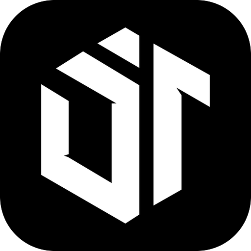
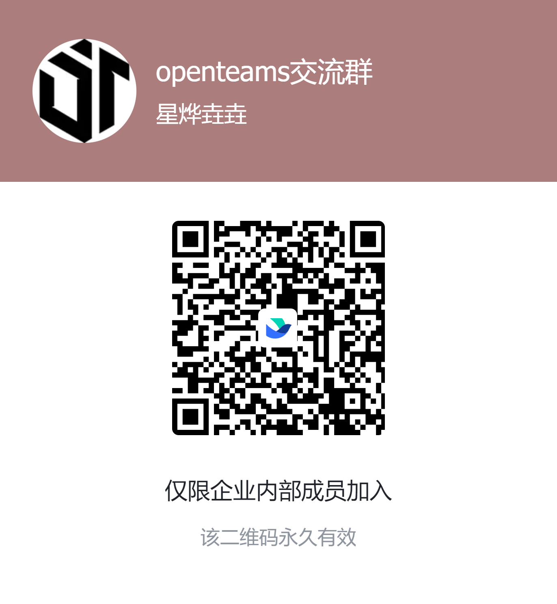

<div align="center">
  
</div>

<div align="center">
  

  <h5>规划、构建、交付——不再只靠一个 AI，而是与你的 AI 团队并肩完成</h5>

  <p>
    openteams 是一款开源、本地优先的 AI 桌面应用，帮助独立开发者通过一支可控的 AI 团队，更快地规划、构建和交付软件。
  </p>

  <p>
    <a href="https://www.npmjs.com/package/openteams-web"></a>
    <a href="https://github.com/openteams-lab/openteams/actions/workflows/pre-release.yml"></a>
    <a href="../LICENSE"></a>
    <a href="https://discord.gg/MbgNFJeWDc"></a>
    <a href="images/openteams-wechat-community.png"></a>
    <a href="images/openteams-feishu-community.png"></a>
    <a href="https://doc.openteams-lab.com/getting-started"></a>
  </p>

  <p>
    <a href="#快速开始">快速开始</a> |
    <a href="https://doc.openteams-lab.com">文档</a> 
  </p>

  <p align="center">
    <a href="../README.md">English</a> |
    <a href="./README_zh-Hans.md">简体中文</a> |
    <a href="./README_zh-Hant.md">繁體中文</a> |
    <a href="./README_ja.md">日本語</a> |
    <a href="./README_ko.md">한국어</a> |
    <a href="./README_fr.md">Français</a> |
    <a href="./README_es.md">Español</a>
  </p>
</div>

---
<div align="center">
  <video src="https://github.com/user-attachments/assets/fdf0ef91-5b02-4302-bdec-087c1995a590" controls autoplay muted playsinline width="100%">
    <a href="https://github.com/user-attachments/assets/fdf0ef91-5b02-4302-bdec-087c1995a590">观看产品视频</a>
  </video>
</div>

## openteams 到底是什么？

你已经在用 Claude Code、Codex、Gemini CLI 或其他编程 Agent。单独用都没问题。然后你打开第二个终端、第三个终端：同一份背景要讲很多遍，结果要从一个窗口搬到另一个窗口，谁在改什么全靠自己记。很快，你管理的就不再是工作，而是这些 Agent：改动散落在不同会话中，项目优先级记录在别处，Token 用量与实际交付的内容彼此脱节。

openteams 补上的是这些 Agent 周围缺少的东西：**一个让它们对话和交接工作的共享空间、一份你能看见并控制的执行计划，以及一套把项目事项与 Agent 产出关联起来、但不把项目路线图交给 Agent 的轻量事项记录。**

| openteams **是** | openteams **不是** |
| --- | --- |
| 一个连接你现有编程 Agent 的本地优先工作区 | 一个新模型，或 Claude Code、Codex、Gemini CLI 的替代品 |
| 一个让 Agent 对话、交接任务并共享上下文的会话 | 一堆仍然需要你手动协调的独立聊天窗口 |
| 一份由开发者维护、与 Agent 会话关联的事项清单 | 一套完整的项目管理系统，或由 Agent 自行修改的路线图 |
| 一套可以逐步查看、审查、中断和重试的工作流 | 一个提交后只能等结果的黑盒大提示词 |
| 可以分别审查、合并或丢弃的隔离 worktree | 多个 Agent 同时修改同一工作区，彼此干扰 |
| 能看清 Agent 交付、用量和成本的构建统计 | 只显示消耗、不记录产出的 Token 计数器 |

**具体来说，安装后你会得到：** 用于轻量协作和计划执行的聊天会话、开箱即用的团队工作流程模板、把工作内容关联到会话且由开发者掌控的事项、用于隔离并行任务的独立工作区，以及完整的构建统计。

```text
没有 openteams                    使用 openteams

Claude ─ 终端 A ─┐                Claude ─┐
Codex ── 终端 B ─┼─ 由你传话      Codex ──┼─ 共享会话
Gemini ─ 终端 C ─┘                Gemini ─┘

计划：放在别处                   事项 ── 会话 ── 构建产出
```

## 为什么选择 openteams

现在让 Agent 写出代码并不难，难的是把这些工作管好：上下文能不能接上、执行到哪一步、并行任务会不会互相覆盖、接下来该做什么，以及这次开发到底花了多少。

openteams 把 Agent 和相关对话放在同一个会话里。任务复杂时，工作流模式会把步骤和依赖展示出来，你可以单独审查或重试其中一步，不必全部重来。如果多个会话同时工作，还可以为每个会话使用独立的 Git worktree，让未完成的改动彼此隔离，最后再决定合并还是丢弃。

项目方向始终由开发者决定。事项记录你选定的工作，并关联 Agent 实际执行这些工作的会话；Agent 负责干活，但不会替你改计划。工作完成后，构建统计会把交付结果和本次使用的 Token、成本放在一起展示。

openteams 想做的不是再多接几个 Agent，而是让你随时知道：现在在做什么，改动在哪里，下一步是什么，以及这些结果花了多少。

## 快速开始
### 安装
#### 桌面应用（推荐）

请从 GitHub Releases 下载适合你平台的最新版本。

[](https://github.com/openteams-lab/openteams/releases/latest/download/openteams-windows-x64.msi)
[](https://github.com/openteams-lab/openteams/releases/latest/download/openteams-macos.dmg)
[](https://github.com/openteams-lab/openteams/releases/latest/download/openteams-linux-amd64.deb)

**macOS：** 当前 macOS 版本尚未使用 Apple Developer ID 签名和公证。浏览器会给从互联网下载的 App 添加隔离属性，因此即使下载文件完好，Gatekeeper 也可能提示 openteams“已损坏”。将 `openteams.app` 拖入 `/Applications` 后，请仅在确认它来自 openteams 官方 GitHub Release 时运行：

```bash
xattr -dr com.apple.quarantine /Applications/openteams.app
```

此命令只会移除 openteams 的隔离属性，不会全局关闭 Gatekeeper。

#### npx

```bash
npx openteams-web
```

### 配置提供商

**openteams** 内置 openteams CLI Agent。你可以在应用中通过 `Settings → Provider Config → Add Provider` 配置模型提供商。参考文档：

⚙️ [提供商配置](https://doc.openteams-lab.com/advanced-usage/custom-provider)

你也可以连接以下 openteams 支持的编程 Agent：

| Agent | 安装示例 |
| --- | --- |
| Claude Code | `npm i -g @anthropic-ai/claude-code` |
| Gemini CLI | `npm i -g @google/gemini-cli` |
| Codex | `npm i -g @openai/codex` |
| Qwen Code | `npm i -g @qwen-code/qwen-code` |
| OpenCode | `npm i -g opencode-ai` |

📚 [更多 Agent 安装指南](https://doc.openteams-lab.com/getting-started)

## 重要更新
- **2026.05.20 (v0.4.4)**
  - 工作流模式 beta 版
- **2026.05.07 (v0.3.22)**
  - 支持一键将群聊会话中的成员保存为预设团队
- **2026.04.14 (v0.3.15)**
  - 工作区文件变更查看器
- **2026.04.06 (v0.3.12)**
  - 启用深色 UI 模式
  - 修复 openteams-cli 并发问题
- **2026.04.02 (v0.3.10)**
  - 实现应用内版本更新
  - 文档网站已上线

## 路线图

openteams 正在积极开发中。接下来我们会朝这些方向推进：

- [ ] **领域专家型 AI 员工** — 推出更多具备专业领域知识、能够解决专业问题的 AI 员工。
- [ ] **高产出的 AI 团队** — 由高效的专家型 AI 员工组成，可针对特定业务定制生产工作流，将需求端到端转化为可交付成果。
- [ ] **集成更多 Agent** — 集成更多常用 Agent，例如 Kilo Code、hermes-agent 和 openclaw。

***愿景：把 Token 消耗转化为真正的生产力。***

有功能建议，或想参与塑造产品方向？欢迎[发起讨论](https://github.com/openteams-lab/openteams/discussions)。

## 社区

- [GitHub Issues](https://github.com/openteams-lab/openteams/issues)：bug 报告和功能请求
- [GitHub Discussions](https://github.com/openteams-lab/openteams/discussions)：产品想法和问题
- [Discord](https://discord.gg/openteams)：社区聊天
- [Linux.do](https://linux.do)：友情链接，感谢提供社区交流支持
- 社区群：

<p>
  <a href="images/openteams-wechat-community.png"></a>
  <a href="images/openteams-feishu-community.png"></a>
</p>

## 核心功能

| 功能 | 含义 |
| --- | --- |
| AI 员工与 AI 团队 | 把 Token 直接转化为生产力。每个 AI 员工或团队都拥有特定领域的专业知识，能将通用模型提升为领域专家——不只是生成文本，而是真正产出可交付的工作成果。 |
| 多 Agent 工作区 | 把多个 AI Agent 带入同一个共享会话，不再在多个窗口之间来回切换。 |
| 共享上下文 | Agent 基于同一份对话和项目上下文工作。 |
| 自由聊天模式 | 使用 `@` 进行直接、轻量的 Agent 协作。 |
| 工作流模式 | 将复杂任务转换为结构化步骤、依赖、审查、重试和验收。 |
| 可见执行 | 看到每个 Agent 正在做什么，以及工作卡在哪里。 |
| 审查与重试 | 审查某一步的结果，精确重试失败的任务，无需重启整个项目。 |
| 事项管理 | 记录并排序由开发者掌控的工作项，从 GitHub 同步事项，并创建或关联执行会话。 |
| 隔离工作区 | 在独立的 Git worktree 中执行不同会话的任务，再分别审查、合并或丢弃结果，避免相互干扰。 |
| 构建统计 | 对照 Bug 修复和功能交付情况，查看不同会话与模型的 Token 用量和成本明细。 |
| 产物与轨迹 | 将日志、diff、对话记录和生成的产物附加到工作上。 |
| 本地工作区执行 | Agent 在你配置的工作区中工作，运行记录保存在 `.openteams/` 下。 |

## 适合谁

openteams 适合：

- 正在使用多个编程 Agent、但已经厌倦来回切换和协调的开发者
- 需要让 Agent 运行过程可审查、可复现的技术负责人

它不只是一个收纳更多 Agent 的容器，而是把 Agent 变成真正能协作交付的工作团队。

## 技术栈

| 层 | 技术 |
| --- | --- |
| 前端 | React, TypeScript, Vite, Tailwind CSS |
| 后端 | Rust |
| 桌面端 | Tauri |
| 数据库 | SQLx 管理的关系型 schema |
| 工作流 UI | React Flow |

## 本地开发

### 前置条件

- **Rust** >= 1.75
- **Node.js** >= 18
- **pnpm** >= 8

### macOS、Linux 和 Windows

```bash
# Clone the repository
git clone https://github.com/openteams-lab/openteams.git
cd openteams
pnpm i
npm run dev
# build
pnpm --filter frontend build
pnpm desktop:build
```

### 本地构建 `openteams-cli`

如果你需要编译本地 `openteams-cli` 二进制文件，而不是使用内置或已发布的构建，请使用以下命令。
构建产物会放在 binaries 目录中。

```bash
# From the repository root
bun run ./scripts/build-openteams-cli.ts
```

## 贡献

欢迎贡献，也欢迎分享可供其他开发者学习和复用的 AI 团队工作流。你可以这样开始：

1. **寻找 Issue** — 查看 [Good First Issues](https://github.com/openteams-lab/openteams/labels/good%20first%20issue) 寻找适合新手的任务，或浏览开放中的 Issue。
2. **开发前先讨论** — 在提交大型 PR 前，请先开启 Issue 或 Discussion，以便对齐方向。
3. **遵循代码风格** — 提交前请运行：

```bash
pnpm run format
pnpm run check
pnpm run lint
```

4. **提交 PR** — 说明你改了什么以及为什么改。如有相关 Issue，请一并链接。

完整指南请见 [CONTRIBUTING.md](../CONTRIBUTING.md)。

## 许可证

openteams 基于 Apache License 2.0 发布。简单来说，你可以：

- 免费用于个人、教育、内部或商业项目；
- 复制、修改源代码，并在此基础上继续开发；
- 以源代码或编译后软件的形式分发原版或修改版；
- 集成到闭源产品中并收费，无需因此公开产品的其余代码。

如果你再分发 openteams 或其修改版，需要附带许可证副本，保留相关版权和署名声明，并清楚标明修改过的文件。

另外还有三点：

- **品牌：** 你可以使用代码，但不能冒充 openteams 官方，也不能把 openteams 的名字或商标当成自己的品牌。
- **专利：** 代码贡献者授权你使用其贡献内容必然涵盖的专利，因此不能利用这些专利阻止你使用 openteams。作为交换，如果你以“openteams 侵犯我的专利”为由提起诉讼，你将失去这项专利保护。失效的只是专利许可，不是普通的代码使用权；未涉及专利诉讼的用户通常不受影响。
- **风险：** 软件免费按现状提供。是否满足你的需求、使用中会不会出现问题，都需要你自己判断并承担风险；项目方不提供保修或赔偿。

本节仅为通俗摘要，具有法律效力的条款以 [LICENSE](../LICENSE) 文件为准。

完整法律条款请见 [LICENSE](../LICENSE)。
