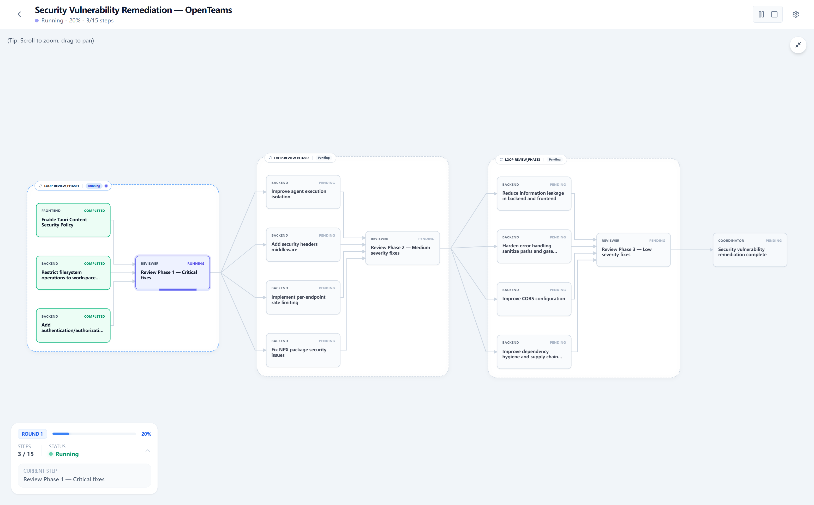

<div align="center">
  
</div>

<div align="center">
  

  <h5>规划、构建、交付——不再只靠一个 AI，而是与你的 AI 团队并肩完成</h5>

  <p>
    openteams 是一款开源、本地优先的 AI 桌面应用，帮助独立开发者通过一支可控的 AI 团队，更快地规划、构建和交付软件。
  </p>

  <p>
    <a href="https://www.npmjs.com/package/openteams-web"></a>
    <a href="https://github.com/openteams-lab/openteams/actions/workflows/pre-release.yml"></a>
    <a href="../LICENSE"></a>
    <a href="https://discord.gg/MbgNFJeWDc"></a>
    <a href="images/openteams-wechat-community.png"></a>
    <a href="images/openteams-feishu-community.png"></a>
    <a href="https://doc.openteams-lab.com/getting-started"></a>
  </p>

  <p>
    <a href="#快速开始">快速开始</a> |
    <a href="https://doc.openteams-lab.com">文档</a> 
  </p>

  <p align="center">
    <a href="../README.md">English</a> |
    <a href="./README_zh-Hans.md">简体中文</a> |
    <a href="./README_zh-Hant.md">繁體中文</a> |
    <a href="./README_ja.md">日本語</a> |
    <a href="./README_ko.md">한국어</a> |
    <a href="./README_fr.md">Français</a> |
    <a href="./README_es.md">Español</a>
  </p>
</div>

---
<div align="center">
  <video src="https://github.com/user-attachments/assets/f918d5c7-68ff-4a8b-b2b4-f4f0ab31c17d" controls width="100%">
    <a href="https://github.com/user-attachments/assets/f918d5c7-68ff-4a8b-b2b4-f4f0ab31c17d">观看产品视频</a>
  </video>
</div>

## 什么是 openteams

**openteams** 是一个开源的多智能体协作工作区。它将 Claude Code、Codex、Gemini CLI 等多个 AI 编程智能体带入同一个共享会话，让它们可以交流、共享上下文，并像团队一样协同工作。你可以通过轻量的自由聊天模式与智能体协作，也可以通过结构化工作流编排复杂任务，获得可视化计划、步骤级控制和可追溯审查。可选的隔离工作区会为每个会话创建独立的 Git worktree，让智能体执行不同任务时互不干扰。除了执行任务，openteams 还帮助你管理从想法到交付的完整过程：通过事项查看进度和优先级、同步 GitHub 工作项，并把每个事项关联到实际执行它的会话。工作完成后，构建统计会把交付结果与不同会话、模型和任务的 Token 消耗及成本关联起来，让产出和效率一目了然。所有内容都在你自己的本地工作区中运行。

## 为什么选择 openteams

AI 智能体已经越来越擅长规划、编码、审查和测试。但更多智能体输出，并不意味着会自动变成真正交付的工作。

**管理多个 Agent 令人疲惫。** 你在终端之间反复切换，每换一个 Agent 都要重新交代背景，把上一个 Agent 的输出手动搬到下一个的提示词里，还要人肉合并相互矛盾的 diff。你的注意力在多个 Agent 的混乱切换中被消耗殆尽。

**Agent 的执行过程既看不见，也控不住。** 你让 Claude Code「把这个功能做完」，它跑了 15 分钟。你完全不知道它拆了哪些子任务、哪些跑通了、哪些被它悄悄跳过了。当前大多数编程 Agent 把复杂任务当作一次性的黑盒执行——执行前没有可见计划，执行中无法逐步审批或否决，失败了也没法只重试出问题的那一步。一旦出错，只能从头再来。

**共享工作区中的独立任务容易相互冲突。** 当不同会话同时修改同一批文件时，尚未完成的改动会串入其他任务，智能体彼此干扰，也很难单独审查或合并每个结果。

**把开发交给 Agent 后，你可能逐渐失去对项目的整体把握。** 一个功能完成后，下一步往往只存在于你的脑中或散落在不同提示词里。当每项工作都从一次新对话开始时，你很难看清完整路线、安排优先级，也无法判断项目是否正朝着一次完整交付前进。

**Token 用量容易统计，却很难和实际价值对应。** Token 分散消耗在不同智能体、会话和模型中，但一个总数无法告诉你修复了多少 Bug、交付了多少功能。如果不能把成本和产出关联起来，就无法判断 Agent 驱动的开发是否真的在变得更高效。

**openteams** 为整个开发过程带来清晰度和控制力。所有智能体在同一个会话中共享上下文，不再需要反复切换和搬运信息。复杂任务会变成**可见、可控的工作流图表**——你可以在执行前审阅和调整计划，实时观察每个步骤，并随时批准、拒绝、重试或重新指派任意节点。

隔离工作区为每个会话提供独立的 Git worktree，让智能体执行不同任务时不会共享未完成的改动。你可以单独审查每个会话的结果，再按自己的判断合并或丢弃。

事项管理把项目路线重新交回开发者手中。你可以记录和排序待办工作，并直接从事项创建或关联轻量的执行会话。事项由开发者掌控，不会被智能体擅自修改，因此下一步做什么、项目进展如何，始终有一份由你维护的真实来源。

构建统计补上投入与结果之间的反馈闭环。它会显示本周修复了多少 Bug、交付了多少功能、消耗了多少 Token，并提供会话和模型维度的明细。你不仅能看到花了多少，也能看到这些投入带来了什么。

> 真正的生产力杠杆不在于拥有更多 Agent，而在于始终掌控它们做什么、如何执行，以及最终产出是否值得投入。

## 常见使用场景

你输入：“给工作区增加 GitHub issue 同步功能。”


1. **主 Agent 澄清需求：** 它会询问同步方向（单向还是双向？）、冲突处理方式（跳过、覆盖还是记录？），以及要映射哪些 issue 字段。你确认：单向拉取、记录冲突、映射 title/body/labels/status。
2. **主 agent 设计方案并生成执行计划：** 计划显示 5 个步骤：`Backend: OAuth + GitHub API` → `Backend: Sync Engine` → `Frontend: Sync Status UI` → `Integration Tests` → `Final Review`。每一步都有明确范围、分配的智能体和验收标准。
3. **你审查并批准计划：** 在任何代码运行前，你可以调整步骤、重排依赖或重新分配智能体。
4. **智能体执行，你实时观察进度：** `Backend: OAuth` 先运行。完成后，`Sync Engine` 和 `Frontend: Sync Status UI` 并行启动。每个步骤都会在工作流图上显示状态、diff 和日志。
5. **你审查并批准每个完成的步骤：** `Backend: OAuth` 完成后，你检查 diff，看到 token refresh 逻辑，然后批准。后续步骤继续推进。
6. **某一步失败，你只重试该步骤：** `Integration Tests` 失败，因为同步引擎返回了原始时间戳而不是 ISO 格式。你查看错误日志，然后只重试 `Integration Tests` 这一步。其余工作流保持不变。
7. **最终审查与验收：** 所有步骤通过。你审查完整 diff、产物和测试结果，然后接受。
8. **通过自由聊天模式跟进：** 两天后，用户反馈同步状态徽标在轮询时闪烁。你打开自由聊天模式：`@Frontend Agent 的同步状态标志在轮询时会闪烁 —— 请对状态更新进行防抖处理。`。一轮修复完成，不需要启动工作流。

## 快速开始
### 安装
#### npx

```bash
npx openteams-web
```

#### 桌面应用

请从 GitHub Releases 下载适合你平台的最新版本。

[](https://github.com/openteams-lab/openteams/releases/latest)
[](https://github.com/openteams-lab/openteams/releases/latest)

### 配置提供商

**openteams** 内置 openteams CLI 智能体。你可以在应用中通过 `menu->setting->provider config->add provider` 配置模型提供商。参考文档：

⚙️ [提供商配置](https://doc.openteams-lab.com/advanced-usage/custom-provider)

你也可以连接以下openteams支持的编程智能体：

| Agent | 安装示例 |
| --- | --- |
| Claude Code | `npm i -g @anthropic-ai/claude-code` |
| Gemini CLI | `npm i -g @google/gemini-cli` |
| Codex | `npm i -g @openai/codex` |
| Qwen Code | `npm i -g @qwen-code/qwen-code` |
| OpenCode | `npm i -g opencode-ai` |

📚 [更多智能体安装指南](https://doc.openteams-lab.com/getting-started)

### 30 秒上手
**前置条件：配置一个 API 服务提供商，或安装任意一个openteams支持的 Code Agent。**

*第 1 步。* 创建一个群聊会话。添加一个或多个成员，并为每个成员分配模型和角色。

*第 2 步。* 在自由聊天模式中，用 `@` 提及任意成员来发送消息或分配任务。

*第 3 步。* 切换到工作流模式。与主agent讨论需求、细化方案，并生成执行计划。

*第 4 步。* 启动执行，并在每个任务节点完成时审查结果。

## 工作模式

**openteams** 提供两种协作模式，因为不是所有任务都需要同样的结构化程度。可以类比 **Claude Code 的 Plan 与 Build 模式**，但这里是面向多 Agent 团队的：想让 Agent 自由探索讨论时用自由聊天模式，需要可靠、可预期的执行时用工作流模式。

### 自由聊天模式

在自由聊天模式中，你用 `@` 给任意 Agent 发送任务，Agent 之间也可以自由传递消息。协作规则由你定义的团队协议约束——谁负责什么、如何交接、遵循哪些标准。

**自由聊天模式**适合小修复、快速审查，以及不值得启动完整工作流的探索性讨论。


### 工作流模式

工作流模式专为复杂任务设计——当任务需要拆分为多个子任务，且你需要全程观察进度、在每一步保持可控执行时，它就是最佳选择。

主 Agent 负责驱动规划阶段：澄清需求、设计方案、制定执行计划，并将任务分配给合适的 Agent。最终生成一张可视化的工作流图，包含步骤、依赖关系、审查节点、重试机制和验收点。



工作流模式不会让 Agent 松散地串联运行，而是把工作转化为有状态的执行图。

**注意：工作流模式会消耗更多 token。请确保你的 token 余额充足。**

## 重要更新
- **2026.05.20 (v0.4.4)**
  - 工作流模式 beta 版
- **2026.05.07 (v0.3.22)**
  - 支持一键将群聊会话中的成员保存为预设团队
- **2026.04.14 (v0.3.15)**
  - 工作区文件变更查看器
- **2026.04.06 (v0.3.12)**
  - 启用深色 UI 模式
  - 修复 openteams-cli 并发问题
- **2026.04.02 (v0.3.10)**
  - 实现应用内版本更新
  - 文档网站已上线

## 路线图

openteams 正在积极开发中。接下来我们会朝这些方向推进：

- [ ] **专家型的AI员工** — 推出更多拥有专业领域知识，能解决专业问题的AI员工。
- [ ] **高产出的AI团队** — 由高效的专家AI员工组成，可针对特定业务定制化生产工作流程，端到端将需求转换为产出结果。
- [ ] **集成更多智能体** — 集成更多常用Agent，如Kilo code, hermes-agent, openclaw等。

***愿景：把 token 消耗转化为真正的生产力。***

有功能建议，或想参与塑造产品方向？欢迎[发起讨论](https://github.com/openteams-lab/openteams/discussions)。

## 社区

- [GitHub Issues](https://github.com/openteams-lab/openteams/issues)：bug 报告和功能请求
- [GitHub Discussions](https://github.com/openteams-lab/openteams/discussions)：产品想法和问题
- [Discord](https://discord.gg/openteams)：社区聊天
- [Linux.do](https://linux.do)：友情链接，感谢提供社区交流支持
- 社区群：

<p>
  <a href="images/openteams-wechat-community.png"></a>
  <a href="images/openteams-feishu-community.png"></a>
</p>

## 核心功能

| 功能 | 含义 |
| --- | --- |
| AI 员工与 AI 团队 | 把 token 直接转化为生产力。每个 AI 员工或团队都拥有特定领域的专业知识，能将通用模型提升为领域专家——不只是生成文本，而是真正产出可交付的工作成果。 |
| 多智能体工作区 | 把多个 AI 智能体带入同一个共享会话，不再在多个窗口之间来回切换。 |
| 共享上下文 | 智能体基于同一份对话和项目上下文工作。 |
| 自由聊天模式 | 使用 `@` 进行直接、轻量的智能体协作。 |
| 工作流模式 | 将复杂任务转换为结构化步骤、依赖、审查、重试和验收。 |
| 可见执行 | 看到每个智能体正在做什么，以及工作卡在哪里。 |
| 审查与重试 | 审查某一步的结果，精确重试失败的任务，无需重启整个项目。 |
| 事项管理 | 记录并排序由开发者掌控的工作项，从 GitHub 同步事项，并创建或关联执行会话。 |
| 隔离工作区 | 在独立的 Git worktree 中执行不同会话的任务，再分别审查、合并或丢弃结果，避免相互干扰。 |
| 构建统计 | 对照 Bug 修复和功能交付情况，查看不同会话与模型的 Token 用量和成本明细。 |
| 产物与轨迹 | 将日志、diff、转录和生成的产物附加到工作上。 |
| 本地工作区执行 | 智能体在你配置的工作区中工作，运行记录保存在 `.openteams/` 下。 |

## 适合谁

openteams 适合：

- 正在使用多个编程智能体、但已经厌倦来回切换和协调的开发者
- 需要让智能体运行过程可审查、可复现的技术负责人

它不只是一个收纳更多 Agent 的容器，而是把 Agent 变成真正能协作交付的工作团队。

## 技术栈

| 层 | 技术 |
| --- | --- |
| 前端 | React, TypeScript, Vite, Tailwind CSS |
| 后端 | Rust |
| 桌面端 | Tauri |
| 数据库 | SQLx 管理的关系型 schema |
| 工作流 UI | React Flow |

## 本地开发

### 前置条件

- **Rust** >= 1.75
- **Node.js** >= 18
- **pnpm** >= 8

### macOS、Linux 和 Windows

```bash
# Clone the repository
git clone https://github.com/openteams-lab/openteams.git
cd openteams
pnpm i
npm run dev
# build
pnpm --filter frontend build
pnpm desktop:build
```

### 本地构建 `openteams-cli`

如果你需要编译本地 `openteams-cli` 二进制文件，而不是使用内置或已发布的构建，请使用以下命令。
构建产物会放在 binaries 目录中。

```bash
# From the repository root
bun run ./scripts/build-openteams-cli.ts
```

## 贡献

欢迎贡献。你可以这样开始：

1. **寻找 issue** — 查看 [Good First Issues](https://github.com/openteams-lab/openteams/labels/good%20first%20issue) 寻找适合新手的任务，或浏览开放 issue。
2. **开发前先讨论** — 在提交大型 PR 前，请先开启 issue 或 discussion，以便对齐方向。
3. **遵循代码风格** — 提交前请运行：

```bash
pnpm run format
pnpm run check
pnpm run lint
```

4. **提交 PR** — 说明你改了什么以及为什么改。如有相关 issue，请一并链接。

完整指南请见 [CONTRIBUTING.md](../CONTRIBUTING.md)。

## 许可证

openteams 基于 Apache License 2.0 发布。简单来说，你可以：

- 免费用于个人、教育、内部或商业项目；
- 复制、修改源代码，并在此基础上继续开发；
- 以源代码或编译后软件的形式分发原版或修改版；
- 集成到闭源产品中并收费，无需因此公开产品的其余代码。

如果你再分发 openteams 或其修改版，需要附带许可证副本，保留相关版权和署名声明，并清楚标明修改过的文件。

另外还有三点：

- **品牌：** 你可以使用代码，但不能冒充 openteams 官方，也不能把 openteams 的名字或商标当成自己的品牌。
- **专利：** 代码贡献者承诺，不会拿与这些代码有关的专利来限制你使用 openteams。作为交换，如果你以“openteams 侵犯我的专利”为由提起诉讼，你将失去这项专利保护。失效的只是专利许可，不是普通的代码使用权；不打专利官司的普通用户基本不受影响。
- **风险：** 软件免费按现状提供。是否满足你的需求、使用中会不会出现问题，都需要你自己判断并承担风险；项目方不提供保修或赔偿。

完整法律条款请见 [LICENSE](../LICENSE)。
