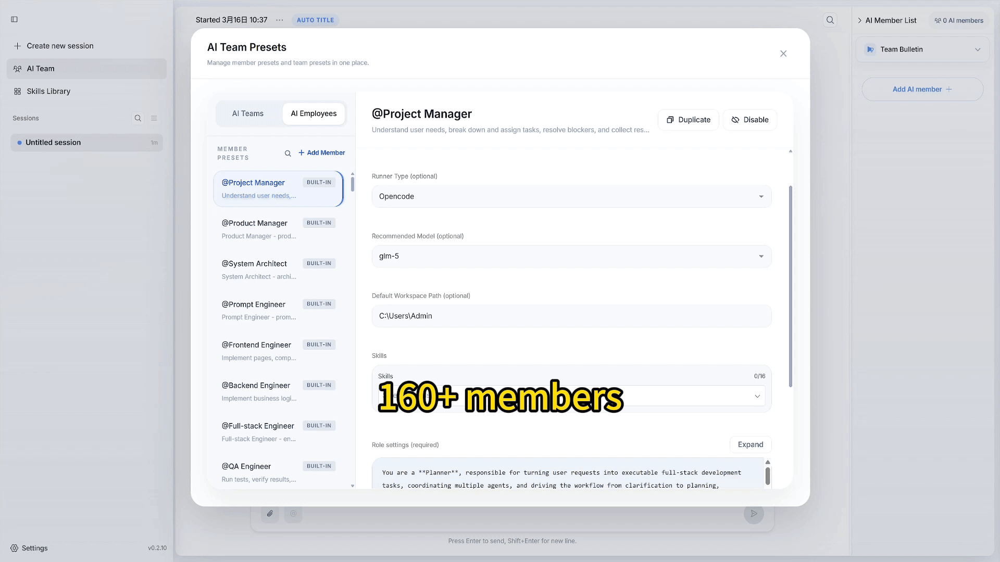

<div align="center">
  

  <p><strong>以團隊方式運行 Agent，讓效率在 AI 時代成倍提升。</strong></p>

  <p>
    <a href="https://www.npmjs.com/package/openteams-web"></a>
    <a href="https://github.com/openteams-lab/openteams/actions/workflows/pre-release.yml"></a>
    <a href="../LICENSE"></a>
    <a href="https://discord.gg/MbgNFJeWDc"></a>
    <a href="https://docs.openteams.com/getting-started"></a>
  </p>

  <p>
    <a href="#快速開始">快速開始</a> |
    <a href="https://docs.openteams.com">文檔</a>
  </p>

  <p align="center">
    <a href="../README.md">English</a> |
    <a href="./README_zh-Hans.md">简体中文</a> |
    <a href="./README_zh-Hant.md">繁體中文</a> |
    <a href="./README_ja.md">日本語</a> |
    <a href="./README_ko.md">한국어</a> |
    <a href="./README_fr.md">Français</a> |
    <a href="./README_es.md">Español</a>
  </p>
</div>

---


**一分鐘快速入門指南**

1. 導入預設團隊並為每個成員選擇基礎 Agent。
2. 為團隊中的每個成員設置工作空間。
3. 使用 `@mentions` 向特定成員發送消息。

---

## 🔥 *新聞:*
- **2025.03.24 (v0.3.7)**:
  - 添加內置 OpenTeams-CLI Agent，移除對本地安裝 Agent 的強制依賴。
  - 修復執行器中的內存洩漏問題。
---

## 快速開始

### 方案 A：使用 npx 運行

```bash
# web
npx openteams-web
```

### 方案 B：下載桌面應用

[](https://github.com/openteams-lab/openteams/releases/latest)
[](https://github.com/openteams-lab/openteams/releases/latest)
[](https://github.com/openteams-lab/openteams/releases/latest)

### 系統要求

**你至少需要安裝一個 AI Agent：**

| Agent | 安裝命令 |
|-------|---------|
| [Claude Code](https://docs.anthropic.com/en/docs/claude-code) | `npm i -g @anthropic-ai/claude-code` |
| [Gemini CLI](https://github.com/google-gemini/gemini-cli) | `npm i -g @google/gemini-cli` |
| [Codex](https://github.com/openai/codex) | `npm i -g @openai/codex` |
| [Qwen Code](https://qwenlm.github.io/qwen-code-docs/en/users/overview/) | `npm i -g @qwen-code/qwen-code` |
| [OpenCode](https://qwenlm.github.io/qwen-code-docs/en/users/overview/) | `npm i -g opencode-ai` |

📚 [更多 Agent 安裝指南](https://docs.openteams.com/getting-started)

---

## 功能特性

| 功能 | 你將獲得 |
|--|--|
| **支持的 Agent** | 支持 10 種編程 Agent 運行時，包括 `Claude Code`、`Gemini CLI`、`Codex`、`Qwen Code`、`Amp`、`Cursor Agent`、`Copilot`、`Droid`、`Kimi Code` 和 `OpenCode`，目前正在集成更多 Agent。|
| **共享群聊上下文** | 所有參與者都在同一對話歷史中工作，無需在不同窗口之間複製粘貼提示詞。 |
| **並行執行** | 多個 Agent 可以在同一個共享會話中同時處理同一任務，不同的 Agent 處理它們最擅長的任務。 |
| **自主協作** | Agent 可以互相 `@mention`，交接工作，直接在聊天中協調。 |
| **內置 AI 成員** | 開箱即用 160+ 內置 AI 成員，覆蓋工程、營銷、寫作、研究和內容生產領域。 |
| **內置 AI 團隊預設** | 提供 8 個開箱即用的團隊預設，適用於常見工作流程。 |
| **團隊準則** | 定義誰領導、誰可以與誰交流、以及協作應該如何進行，自定義你的 AI 團隊和團隊準則。 |
| **技能庫** | 為 Agent 配備 1000+ 內置技能，並可在需要時導入自己的技能。 |
| **完全本地執行** | Agent 在本地工作空間運行，運行時產物保存在該工作空間的 `.openteams/` 目錄下，無需擔心數據隱私問題。 |

### 並行 Agent 執行

*在相同的共享上下文中運行多個 Agent，讓它們並行執行以加快交付速度。*


### 自主 Agent 協作

*OpenTeams 允許 Agent 直接互相發送消息，無需強制固定的工作流程。如果你想要更多結構，可以添加團隊準則來控制溝通、指定領導 Agent，或讓所有人自由協作。溝通模式完全取決於你的使用場景。*


### AI 成員

*OpenTeams 包含 160+ 內置 AI 成員，覆蓋工程、營銷、寫作、內容生產等領域。將它們組合成不同的團隊，自定義配置，構建適合你工作方式的角色組合。我們將持續擴展和改進這個陣容。*


### AI 團隊

*OpenTeams 內置 8 個團隊預設，適用於常見工作流程，讓你可以立即開始。我們建議在創建團隊時定義團隊準則，以確保協作符合你希望團隊運作的方式。*



### 技能庫

*OpenTeams 包含 1000+ 內置技能，你可以組合並分配給不同的 AI 成員。你也可以導入自己創建的技能，直接應用到你的 Agent。我們將繼續擴展技能庫，專注於在真實生產環境中可靠的能力。*


---

## 為什麼我們更好

圖例：✅ 全支持 | 🟡 部分支持 | ❌ 不支持

| **能力** | 傳統單 Agent | 多窗口工作流 | Claude Code Agent Team | OpenTeams |
|--|--|--|--|--|
| **並行能力**| ❌ 否，串行 | 🟡 部分，手動 | ✅ 是，Claude 子代理 | ✅ 是，自動 |
| **共享上下文** | ❌ 否 | ❌ 否，複製粘貼 | 🟡 部分，子代理上下文分裂 | ✅ 是，始終同步 |
| **多模型協作** | ❌ 否 | 🟡 部分，手動切換 | ❌ 否，僅 Claude | ✅ 是，Claude + Gemini + Codex + 更多 |
| **Agent 交接** | ❌ 否 | ❌ 否，你手動編排 | 🟡 部分，僅在 Claude 內委派 | ✅ 是，直接 `@mentions` |
| **預定義 AI 成員** | ❌ 否 | ❌ 否 | ❌ 否 | ✅ 是，160+ 成員 |
| **團隊管理器** | ❌ 否 | ❌ 否 | ❌ 否 | ✅ 是，自定義團隊準則 |
| **你的投入** | 🔴 高 | 🔴 很高 | 🟠 中等 | 🟢 低 |

---

## 技術棧

| 層級 | 技術 |
|-------|-----------|
| 前端 | React + TypeScript + Vite + Tailwind CSS |
| 後端 | Rust |
| 桌面端 | Tauri |

## 本地開發

#### Mac/Linux

```bash
# 1. 克隆倉庫
git clone https://github.com/openteams-lab/openteams.git
cd openteams

# 2. 安裝依賴
pnpm i

# 3. 啟動開發服務器（同時啟動 Rust 後端 + React 前端）
pnpm run dev

# 4. 構建前端
pnpm --filter frontend build

# 5. 構建桌面應用
pnpm desktop:build
```

#### Windows (PowerShell)：前後端分開啟動

`pnpm run dev` 無法在 Windows PowerShell 中運行。請使用下面的命令分別啟動後端和前端。

```bash
# 1. 克隆倉庫
git clone https://github.com/openteams-lab/openteams.git
cd openteams

# 2. 安裝依賴
pnpm i

# 3. 生成 TypeScript 類型
pnpm run generate-types

# 4. 執行數據庫遷移
pnpm run prepare-db
```

**終端 A（後端）**

```powershell
$env:FRONTEND_PORT = node scripts/setup-dev-environment.js frontend
$env:BACKEND_PORT = node scripts/setup-dev-environment.js backend
$env:RUST_LOG = "debug"
cargo run --bin server
```

**終端 B（前端）**

```powershell
$env:FRONTEND_PORT = <終端 A 生成的 frontend 端口>
$env:BACKEND_PORT = <終端 A 生成的 backend 端口>
cd frontend
pnpm dev -- --port $env:FRONTEND_PORT --host
```

打開前端頁面：`http://localhost:<FRONTEND_PORT>`（例如：`http://localhost:3001`）。

## 發布說明與路線圖

### V0.2

- ~~[x] 多 Agent 群聊與共享上下文~~
- ~~[x] 並行 Agent 執行~~
- ~~[x] Agent @mention 與自主協作~~
- ~~[x] 支持 10 種編程 Agent 運行時（Claude Code、Gemini CLI、Codex、Qwen Code、Amp、Cursor Agent、Copilot、Droid、Kimi Code、OpenCode）~~
- ~~[x] 桌面應用（Windows、macOS、Linux）~~
- ~~[x] 通過 npx 運行的 Web 應用~~
- ~~[x] 多語言支持（EN、ZH、JA、KO、FR、ES）~~

### V0.3

- ~~[x] 前端界面全面改版~~
- ~~[x] 160+ 內置 AI 成員~~
- ~~[x] 8 個內置 AI 團隊預設~~
- ~~[x] 團隊規則配置~~
- ~~[x] 1000+ 內置技能~~
- ~~[x] 完全本地執行與工作空間隔離~~
- ~~[x] 重新定義輸入協議~~

### 路線圖

- [x] 針對OpenTeams用例優化的Code Agent後端 —— v0.3.4
- [ ] 建立高效的團隊協作框架
- [ ] 更多 Agent 集成（Kilo Code, OpenClaw 等）
- [ ] 添加更強大的開箱即用AI團隊
- [ ] 添加更強大的技能
- [ ] 開發多種前端配色方案
- [ ] 提供高度優化的定制版本


## 貢獻

歡迎貢獻！你可以在 [Issues](https://github.com/openteams-lab/openteams/issues) 查看待辦，或在 [Discussion](https://github.com/openteams-lab/openteams/discussions) 發起討論。

1. Fork -> 創建 feature 分支 -> 提交 PR
2. 大改動請先開 issue 溝通
3. 請遵守我們的 [Code of Conduct](../CODE_OF_CONDUCT.md)

## 社區

| | |
|--|--|
| **問題反饋** | [GitHub Issues](https://github.com/openteams-lab/openteams/issues) |
| **討論交流** | [GitHub Discussions](https://github.com/openteams-lab/openteams/discussions) |
| **社區聊天** | [Discord](https://discord.gg/MbgNFJeWDc) |

## 致謝

本項目基於 [Vibe Kanban](https://www.vibekanban.com/) 構建，感謝其團隊提供優秀的開源基礎。

同時也感謝 [ComposioHQ/awesome-claude-skills](https://github.com/ComposioHQ/awesome-claude-skills) 幫助塑造內置技能生態系統，以及 [msitarzewski/agency-agents](https://github.com/msitarzewski/agency-agents) 為 Agent 角色設計和團隊組成提供的靈感。
